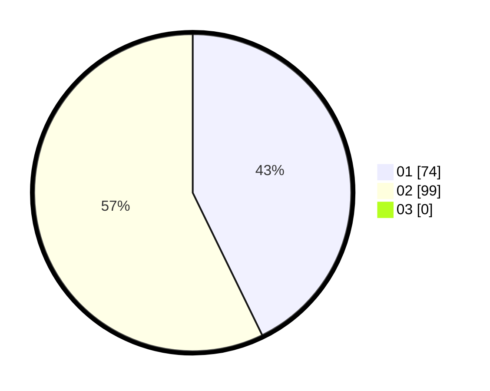

# Hasil

Hasil perolehan suara paslon dapat dilihat pada file paslon-01.txt, paslon-02.txt, dan paslon-03.txt.

Jika tidak ada, artinya data tersebut belum ada pada SIREKAP.

## Perolehan Suara

 * Paslon 01: **74**.
 * Paslon 02: **99**.
 * Paslon 03: **0**.

## Foto C Plano

https://sirekap-obj-formc.kpu.go.id/8d90/pemilu/ppwp/31/75/04/10/02/3175041002107-20240215-012526--480f0ddd-9a00-4a9a-9302-c4e50833f5f4.jpg

https://sirekap-obj-formc.kpu.go.id/8d90/pemilu/ppwp/31/75/04/10/02/3175041002107-20240214-212506--a65cff32-2532-48c4-9661-041cef69e371.jpg

https://sirekap-obj-formc.kpu.go.id/8d90/pemilu/ppwp/31/75/04/10/02/3175041002107-20240214-212633--a21a2b79-7733-45d7-939b-264d56956735.jpg
