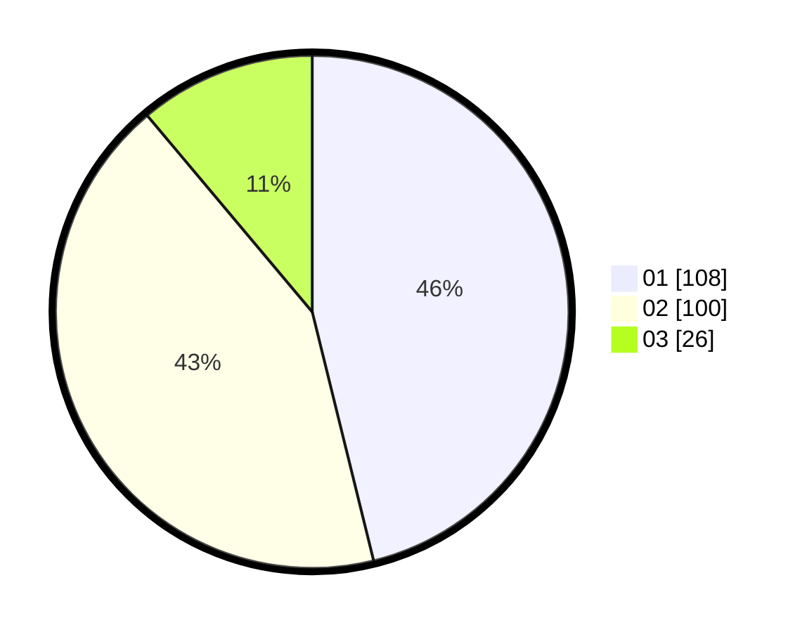

# Hasil

Hasil perolehan suara paslon dapat dilihat pada file paslon-01.txt, paslon-02.txt, dan paslon-03.txt.

Jika tidak ada, artinya data tersebut belum ada pada SIREKAP.

## Perolehan Suara

 * Paslon 01: **108**.
 * Paslon 02: **100**.
 * Paslon 03: **26**.

## Foto C Plano

https://sirekap-obj-formc.kpu.go.id/1323/pemilu/ppwp/31/75/04/10/02/3175041002116-20240217-153115--b1846cc6-43be-4e19-9c7e-e55642e4583c.jpg

https://sirekap-obj-formc.kpu.go.id/1323/pemilu/ppwp/31/75/04/10/02/3175041002116-20240217-153303--8f73ff07-b6e1-4981-9982-abd633790ba2.jpg

https://sirekap-obj-formc.kpu.go.id/1323/pemilu/ppwp/31/75/04/10/02/3175041002116-20240217-153616--ac23bfb1-b96b-43e4-be75-f82729a85862.jpg

## DATA PEMILIH TETAP

Jumlah pemilih dalam DPT: **270**.
 * L: **139**.
 * P: **131**.

## DATA PENGGUNA HAK PILIH

Jumlah pengguna hak pilih dalam DPT: **230**.
 * L: **115**.
 * P: **115**.

Jumlah pengguna hak pilih dalam DPTb: **7**.
 * L: **3**.
 * P: **4**.

Jumlah pengguna hak pilih dalam DPK: **9**.
 * L: **3**.
 * P: **6**.

Jumlah pengguna hak pilih: **246**.
 * L: **121**.
 * P: **125**.

## JUMLAH SUARA SAH DAN TIDAK SAH

JUMLAH SELURUH SUARA SAH: **244**.

JUMLAH SUARA TIDAK SAH: **2**.

JUMLAH SELURUH SUARA SAH DAN SUARA TIDAK SAH: **246**.
