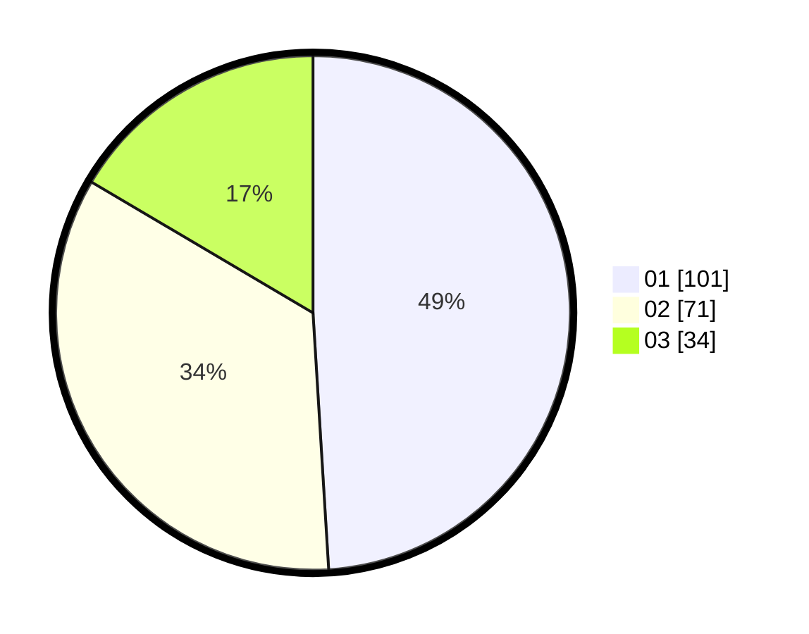

# Hasil

Hasil perolehan suara paslon dapat dilihat pada file paslon-01.txt, paslon-02.txt, dan paslon-03.txt.

Jika tidak ada, artinya data tersebut belum ada pada SIREKAP.

## Perolehan Suara

 * Paslon 01: **101**.
 * Paslon 02: **71**.
 * Paslon 03: **34**.

## Foto C Plano

https://sirekap-obj-formc.kpu.go.id/18ce/pemilu/ppwp/31/75/04/10/02/3175041002118-20240214-193435--4e41c6d5-6e68-4b4f-ad4a-4e0eff012a9f.jpg

https://sirekap-obj-formc.kpu.go.id/18ce/pemilu/ppwp/31/75/04/10/02/3175041002118-20240214-193740--3e50af12-9247-453f-9630-58a675906fec.jpg

https://sirekap-obj-formc.kpu.go.id/18ce/pemilu/ppwp/31/75/04/10/02/3175041002118-20240214-201931--6bd81274-c6d4-430a-828d-8d5b639b928f.jpg

## DATA PEMILIH TETAP

Jumlah pemilih dalam DPT: **269**.
 * L: **130**.
 * P: **139**.

## DATA PENGGUNA HAK PILIH

Jumlah pengguna hak pilih dalam DPT: **205**.
 * L: **96**.
 * P: **109**.

Jumlah pengguna hak pilih dalam DPTb: **0**.
 * L: **0**.
 * P: **0**.

Jumlah pengguna hak pilih dalam DPK: **3**.
 * L: **2**.
 * P: **1**.

Jumlah pengguna hak pilih: **208**.
 * L: **98**.
 * P: **110**.

## JUMLAH SUARA SAH DAN TIDAK SAH

JUMLAH SELURUH SUARA SAH: **206**.

JUMLAH SUARA TIDAK SAH: **2**.

JUMLAH SELURUH SUARA SAH DAN SUARA TIDAK SAH: **208**.
