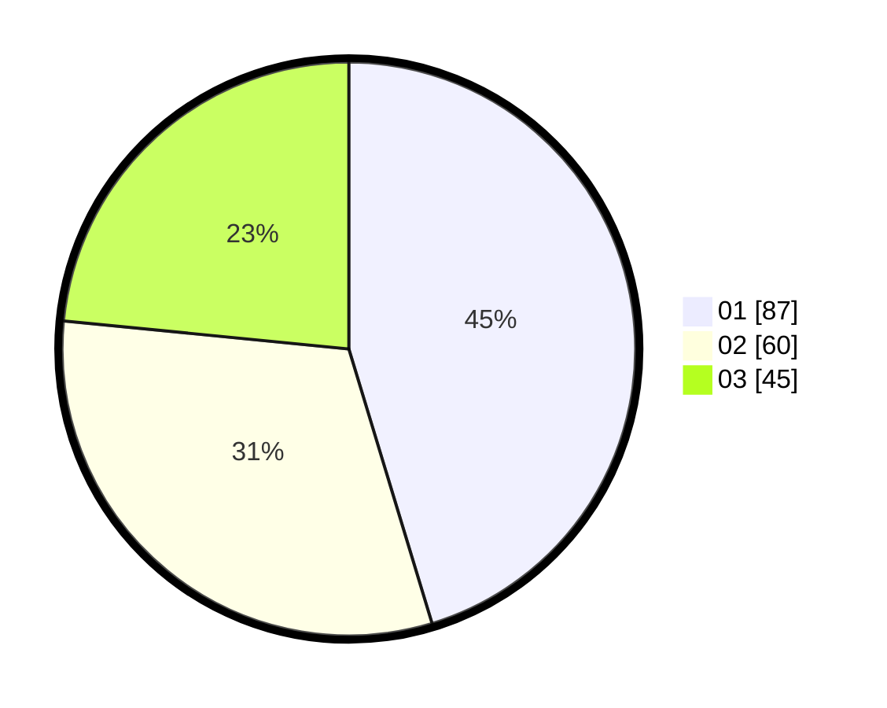

# Hasil

Hasil perolehan suara paslon dapat dilihat pada file paslon-01.txt, paslon-02.txt, dan paslon-03.txt.

Jika tidak ada, artinya data tersebut belum ada pada SIREKAP.

## Perolehan Suara

 * Paslon 01: **87**.
 * Paslon 02: **60**.
 * Paslon 03: **45**.

## Foto C Plano

https://sirekap-obj-formc.kpu.go.id/4fa9/pemilu/ppwp/31/75/04/10/02/3175041002122-20240214-155042--6b746c4f-453e-4e69-94a6-802ad9a41617.jpg

https://sirekap-obj-formc.kpu.go.id/4fa9/pemilu/ppwp/31/75/04/10/02/3175041002122-20240214-155048--afa66410-97d2-47b9-837d-69b677377380.jpg

https://sirekap-obj-formc.kpu.go.id/4fa9/pemilu/ppwp/31/75/04/10/02/3175041002122-20240216-123328--a38bd65e-74e7-46a1-89b5-cfb4ddee226e.jpg

## DATA PEMILIH TETAP

Jumlah pemilih dalam DPT: **262**.
 * L: **137**.
 * P: **125**.

## DATA PENGGUNA HAK PILIH

Jumlah pengguna hak pilih dalam DPT: **192**.
 * L: **94**.
 * P: **98**.

Jumlah pengguna hak pilih dalam DPTb: **0**.
 * L: **0**.
 * P: **0**.

Jumlah pengguna hak pilih dalam DPK: **1**.
 * L: **1**.
 * P: **0**.

Jumlah pengguna hak pilih: **193**.
 * L: **95**.
 * P: **98**.

## JUMLAH SUARA SAH DAN TIDAK SAH

JUMLAH SELURUH SUARA SAH: **192**.

JUMLAH SUARA TIDAK SAH: **1**.

JUMLAH SELURUH SUARA SAH DAN SUARA TIDAK SAH: **193**.
