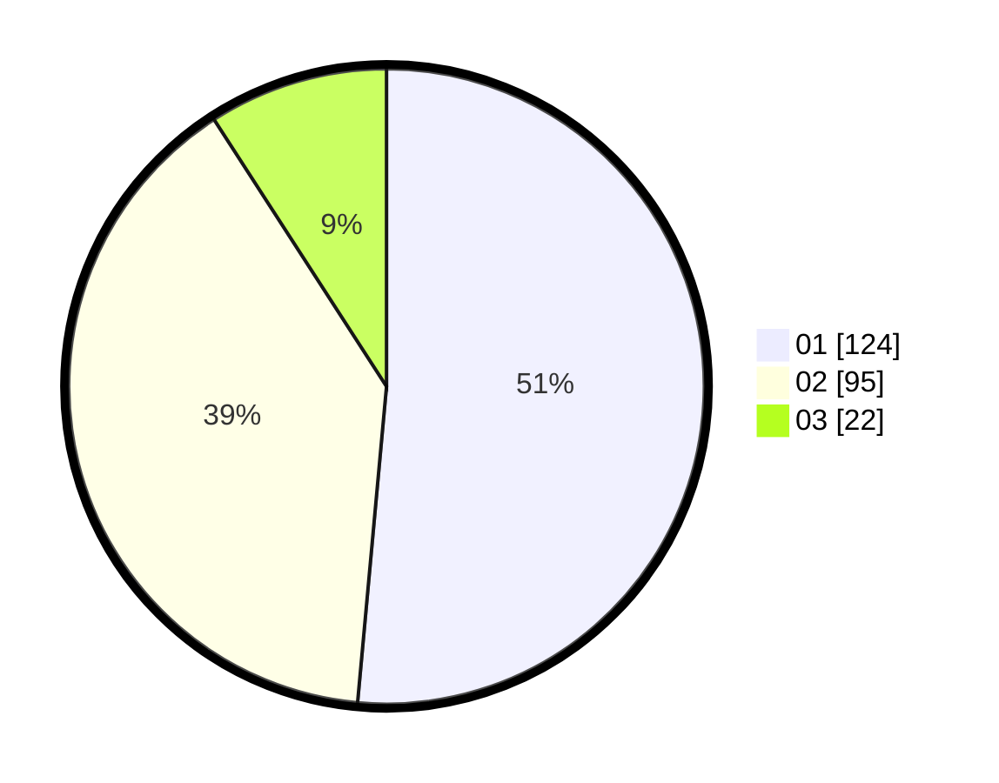

# Hasil

Hasil perolehan suara paslon dapat dilihat pada file paslon-01.txt, paslon-02.txt, dan paslon-03.txt.

Jika tidak ada, artinya data tersebut belum ada pada SIREKAP.

## Perolehan Suara

 * Paslon 01: **124**.
 * Paslon 02: **95**.
 * Paslon 03: **22**.

## Foto C Plano

https://sirekap-obj-formc.kpu.go.id/523c/pemilu/ppwp/31/75/04/10/02/3175041002124-20240216-233856--a5ee44d6-5fa6-4c26-9fc8-cd60cc8fd379.jpg

https://sirekap-obj-formc.kpu.go.id/523c/pemilu/ppwp/31/75/04/10/02/3175041002124-20240219-163218--90dcb27c-f907-4232-add5-3db360e58db3.jpg

https://sirekap-obj-formc.kpu.go.id/523c/pemilu/ppwp/31/75/04/10/02/3175041002124-20240216-235714--186214eb-2733-49bc-a812-9d6de24cf3d4.jpg

## DATA PEMILIH TETAP

Jumlah pemilih dalam DPT: **294**.
 * L: **146**.
 * P: **148**.

## DATA PENGGUNA HAK PILIH

Jumlah pengguna hak pilih dalam DPT: **238**.
 * L: **116**.
 * P: **122**.

Jumlah pengguna hak pilih dalam DPTb: **8**.
 * L: **1**.
 * P: **7**.

Jumlah pengguna hak pilih dalam DPK: **2**.
 * L: **0**.
 * P: **2**.

Jumlah pengguna hak pilih: **248**.
 * L: **117**.
 * P: **131**.

## JUMLAH SUARA SAH DAN TIDAK SAH

JUMLAH SELURUH SUARA SAH: **241**.

JUMLAH SUARA TIDAK SAH: **7**.

JUMLAH SELURUH SUARA SAH DAN SUARA TIDAK SAH: **248**.
