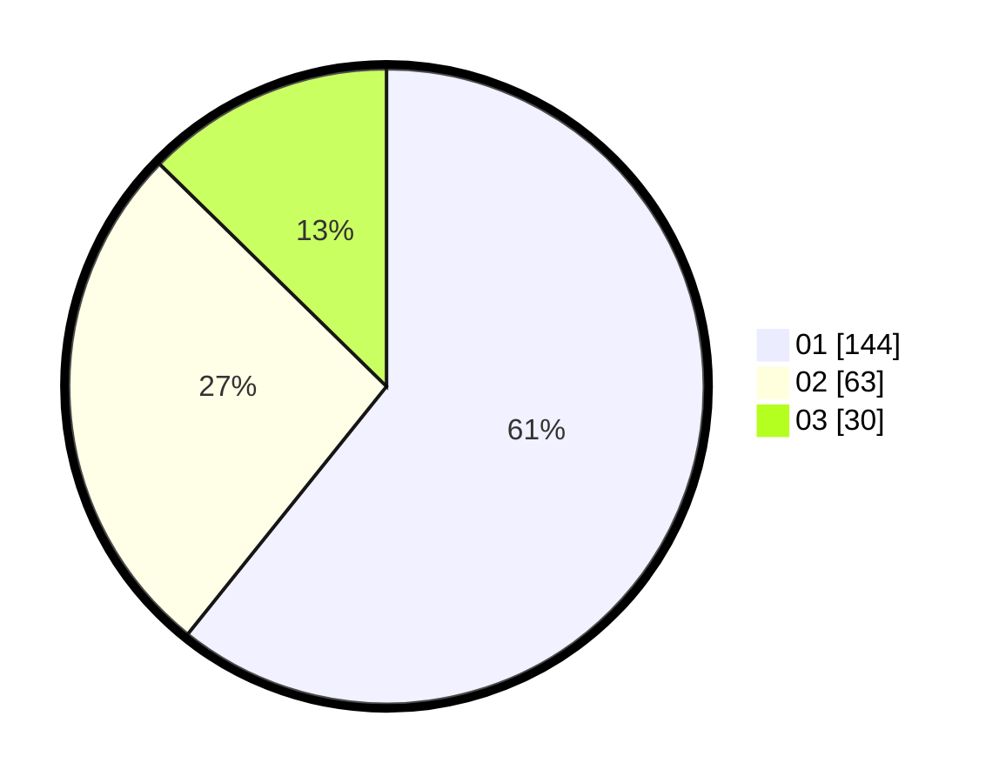

# Hasil

Hasil perolehan suara paslon dapat dilihat pada file paslon-01.txt, paslon-02.txt, dan paslon-03.txt.

Jika tidak ada, artinya data tersebut belum ada pada SIREKAP.

## Perolehan Suara

 * Paslon 01: **144**.
 * Paslon 02: **63**.
 * Paslon 03: **30**.

## Foto C Plano

https://sirekap-obj-formc.kpu.go.id/1a9a/pemilu/ppwp/31/75/04/10/02/3175041002131-20240214-223308--d917c8f2-0f5a-47ba-9686-9bc4dc753c37.jpg

https://sirekap-obj-formc.kpu.go.id/1a9a/pemilu/ppwp/31/75/04/10/02/3175041002131-20240217-082837--be02dba6-7b3a-4714-9322-a8d2f7d6871b.jpg

https://sirekap-obj-formc.kpu.go.id/1a9a/pemilu/ppwp/31/75/04/10/02/3175041002131-20240214-224018--5f2baa3f-38a2-46d3-983c-676ee4d3e111.jpg

## DATA PEMILIH TETAP

Jumlah pemilih dalam DPT: **296**.
 * L: **139**.
 * P: **157**.

## DATA PENGGUNA HAK PILIH

Jumlah pengguna hak pilih dalam DPT: **238**.
 * L: **106**.
 * P: **132**.

Jumlah pengguna hak pilih dalam DPTb: **2**.
 * L: **0**.
 * P: **2**.

Jumlah pengguna hak pilih dalam DPK: **0**.
 * L: **0**.
 * P: **0**.

Jumlah pengguna hak pilih: **240**.
 * L: **106**.
 * P: **134**.

## JUMLAH SUARA SAH DAN TIDAK SAH

JUMLAH SELURUH SUARA SAH: **237**.

JUMLAH SUARA TIDAK SAH: **3**.

JUMLAH SELURUH SUARA SAH DAN SUARA TIDAK SAH: **240**.
