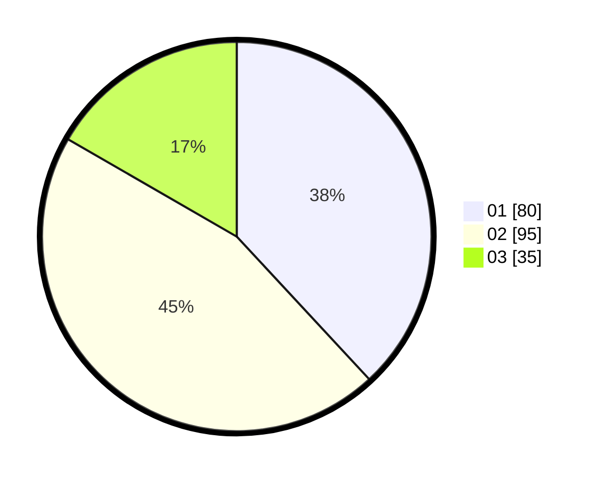

# Hasil

Hasil perolehan suara paslon dapat dilihat pada file paslon-01.txt, paslon-02.txt, dan paslon-03.txt.

Jika tidak ada, artinya data tersebut belum ada pada SIREKAP.

## Perolehan Suara

 * Paslon 01: **80**.
 * Paslon 02: **95**.
 * Paslon 03: **35**.

## Foto C Plano

https://sirekap-obj-formc.kpu.go.id/5970/pemilu/ppwp/31/75/04/10/02/3175041002132-20240217-124308--ac328140-f3d1-4917-a7e1-8ae1f195d8f2.jpg

https://sirekap-obj-formc.kpu.go.id/5970/pemilu/ppwp/31/75/04/10/02/3175041002132-20240217-124137--35a5a3bd-a42c-4672-91f7-e95796be939b.jpg

https://sirekap-obj-formc.kpu.go.id/5970/pemilu/ppwp/31/75/04/10/02/3175041002132-20240217-124224--519ea44e-e94a-4887-84a0-7e7f45c4a774.jpg

## DATA PEMILIH TETAP

Jumlah pemilih dalam DPT: **292**.
 * L: **147**.
 * P: **145**.

## DATA PENGGUNA HAK PILIH

Jumlah pengguna hak pilih dalam DPT: **209**.
 * L: **101**.
 * P: **108**.

Jumlah pengguna hak pilih dalam DPTb: **2**.
 * L: **0**.
 * P: **2**.

Jumlah pengguna hak pilih dalam DPK: **2**.
 * L: **1**.
 * P: **1**.

Jumlah pengguna hak pilih: **213**.
 * L: **102**.
 * P: **111**.

## JUMLAH SUARA SAH DAN TIDAK SAH

JUMLAH SELURUH SUARA SAH: **210**.

JUMLAH SUARA TIDAK SAH: **3**.

JUMLAH SELURUH SUARA SAH DAN SUARA TIDAK SAH: **213**.
