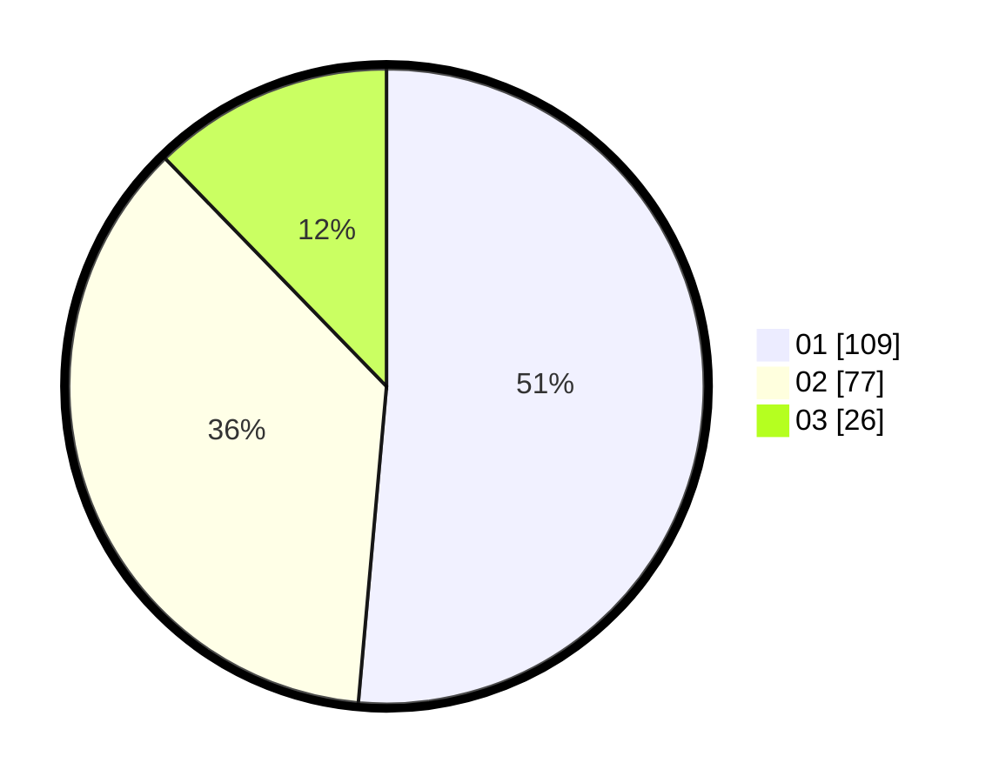

# Hasil

Hasil perolehan suara paslon dapat dilihat pada file paslon-01.txt, paslon-02.txt, dan paslon-03.txt.

Jika tidak ada, artinya data tersebut belum ada pada SIREKAP.

## Perolehan Suara

 * Paslon 01: **109**.
 * Paslon 02: **77**.
 * Paslon 03: **26**.

## Foto C Plano

https://sirekap-obj-formc.kpu.go.id/f571/pemilu/ppwp/31/75/04/10/02/3175041002133-20240214-191633--4eeb34de-e3e7-4926-b7fe-ed2dc113dac3.jpg

https://sirekap-obj-formc.kpu.go.id/f571/pemilu/ppwp/31/75/04/10/02/3175041002133-20240214-221645--8ddb05dd-3ed0-4d22-99b1-f0c09e22cbf8.jpg

https://sirekap-obj-formc.kpu.go.id/f571/pemilu/ppwp/31/75/04/10/02/3175041002133-20240214-191638--a7036f5c-fdd6-4b7d-b19e-d05fdf9489bd.jpg

## DATA PEMILIH TETAP

Jumlah pemilih dalam DPT: **207**.
 * L: **96**.
 * P: **111**.

## DATA PENGGUNA HAK PILIH

Jumlah pengguna hak pilih dalam DPT: **207**.
 * L: **96**.
 * P: **111**.

Jumlah pengguna hak pilih dalam DPTb: **3**.
 * L: **1**.
 * P: **2**.

Jumlah pengguna hak pilih dalam DPK: **5**.
 * L: **3**.
 * P: **2**.

Jumlah pengguna hak pilih: **215**.
 * L: **100**.
 * P: **115**.

## JUMLAH SUARA SAH DAN TIDAK SAH

JUMLAH SELURUH SUARA SAH: **212**.

JUMLAH SUARA TIDAK SAH: **3**.

JUMLAH SELURUH SUARA SAH DAN SUARA TIDAK SAH: **215**.
