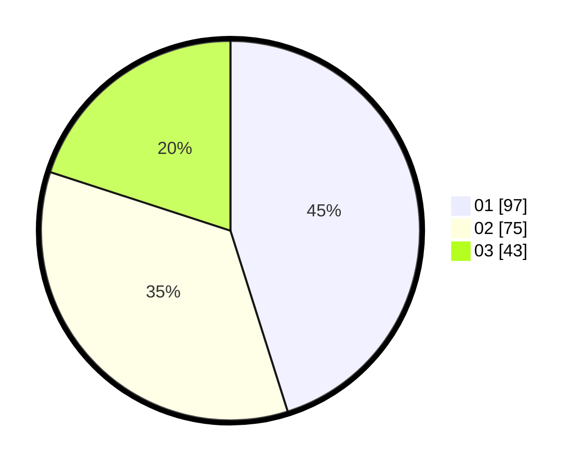

# Hasil

Hasil perolehan suara paslon dapat dilihat pada file paslon-01.txt, paslon-02.txt, dan paslon-03.txt.

Jika tidak ada, artinya data tersebut belum ada pada SIREKAP.

## Perolehan Suara

 * Paslon 01: **97**.
 * Paslon 02: **75**.
 * Paslon 03: **43**.

## Foto C Plano

https://sirekap-obj-formc.kpu.go.id/70cb/pemilu/ppwp/31/75/04/10/02/3175041002136-20240217-090034--a7233b28-2ff2-4d14-9a19-4e88d40c2354.jpg

https://sirekap-obj-formc.kpu.go.id/70cb/pemilu/ppwp/31/75/04/10/02/3175041002136-20240217-090248--c84e84b8-4331-4478-8f58-9ba596221cff.jpg

https://sirekap-obj-formc.kpu.go.id/70cb/pemilu/ppwp/31/75/04/10/02/3175041002136-20240217-090358--290fbd1c-e999-48cb-9027-96e3ed472091.jpg

## DATA PEMILIH TETAP

Jumlah pemilih dalam DPT: **277**.
 * L: **135**.
 * P: **142**.

## DATA PENGGUNA HAK PILIH

Jumlah pengguna hak pilih dalam DPT: **219**.
 * L: **99**.
 * P: **120**.

Jumlah pengguna hak pilih dalam DPTb: **0**.
 * L: **0**.
 * P: **0**.

Jumlah pengguna hak pilih dalam DPK: **0**.
 * L: **0**.
 * P: **0**.

Jumlah pengguna hak pilih: **219**.
 * L: **99**.
 * P: **120**.

## JUMLAH SUARA SAH DAN TIDAK SAH

JUMLAH SELURUH SUARA SAH: **215**.

JUMLAH SUARA TIDAK SAH: **4**.

JUMLAH SELURUH SUARA SAH DAN SUARA TIDAK SAH: **219**.
