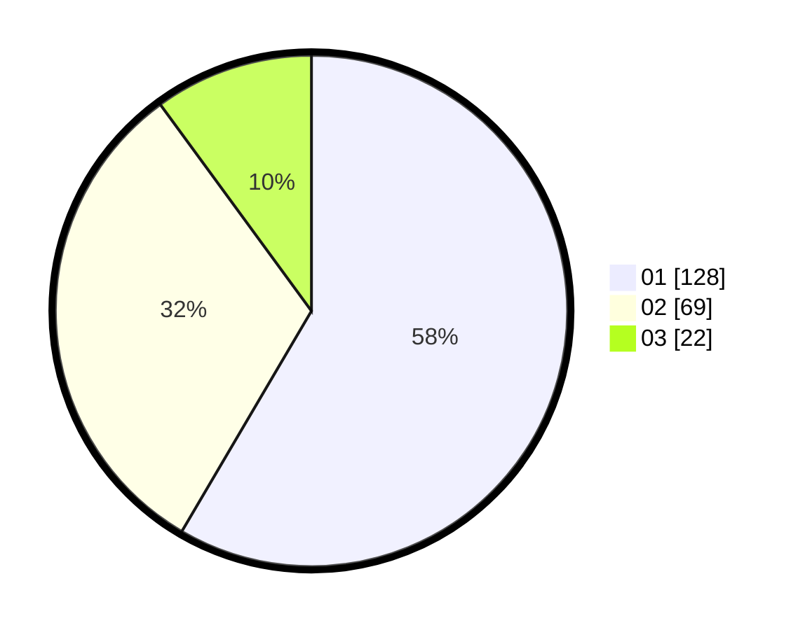

# Hasil

Hasil perolehan suara paslon dapat dilihat pada file paslon-01.txt, paslon-02.txt, dan paslon-03.txt.

Jika tidak ada, artinya data tersebut belum ada pada SIREKAP.

## Perolehan Suara

 * Paslon 01: **128**.
 * Paslon 02: **69**.
 * Paslon 03: **22**.

## Foto C Plano

https://sirekap-obj-formc.kpu.go.id/aebc/pemilu/ppwp/31/75/04/10/02/3175041002140-20240216-213947--aa4f91a8-8a15-4aea-ae21-583a7ad1a37c.jpg

https://sirekap-obj-formc.kpu.go.id/aebc/pemilu/ppwp/31/75/04/10/02/3175041002140-20240217-180227--8556afe3-3f66-4c69-8129-72981db83463.jpg

https://sirekap-obj-formc.kpu.go.id/aebc/pemilu/ppwp/31/75/04/10/02/3175041002140-20240217-001723--bd7196af-6ea1-4f75-9cda-ea52bf6af1d7.jpg

## DATA PEMILIH TETAP

Jumlah pemilih dalam DPT: **265**.
 * L: **135**.
 * P: **130**.

## DATA PENGGUNA HAK PILIH

Jumlah pengguna hak pilih dalam DPT: **217**.
 * L: **108**.
 * P: **109**.

Jumlah pengguna hak pilih dalam DPTb: **3**.
 * L: **2**.
 * P: **1**.

Jumlah pengguna hak pilih dalam DPK: **1**.
 * L: **1**.
 * P: **0**.

Jumlah pengguna hak pilih: **221**.
 * L: **111**.
 * P: **110**.

## JUMLAH SUARA SAH DAN TIDAK SAH

JUMLAH SELURUH SUARA SAH: **219**.

JUMLAH SUARA TIDAK SAH: **2**.

JUMLAH SELURUH SUARA SAH DAN SUARA TIDAK SAH: **221**.
