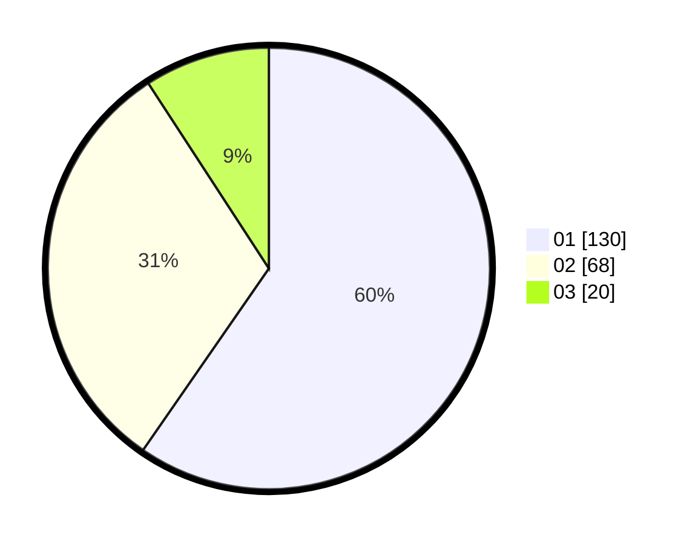

# Hasil

Hasil perolehan suara paslon dapat dilihat pada file paslon-01.txt, paslon-02.txt, dan paslon-03.txt.

Jika tidak ada, artinya data tersebut belum ada pada SIREKAP.

## Perolehan Suara

 * Paslon 01: **130**.
 * Paslon 02: **68**.
 * Paslon 03: **20**.

## Foto C Plano

https://sirekap-obj-formc.kpu.go.id/4a77/pemilu/ppwp/31/75/04/10/02/3175041002141-20240217-002726--ea74abaf-1389-442e-b055-fdb6f5958933.jpg

https://sirekap-obj-formc.kpu.go.id/4a77/pemilu/ppwp/31/75/04/10/02/3175041002141-20240217-171244--2ade35a5-17c1-4578-a170-172b0c28e984.jpg

https://sirekap-obj-formc.kpu.go.id/4a77/pemilu/ppwp/31/75/04/10/02/3175041002141-20240217-171337--79181ec1-983a-40af-8b59-c24c3995a228.jpg

## DATA PEMILIH TETAP

Jumlah pemilih dalam DPT: **269**.
 * L: **134**.
 * P: **135**.

## DATA PENGGUNA HAK PILIH

Jumlah pengguna hak pilih dalam DPT: **219**.
 * L: **106**.
 * P: **113**.

Jumlah pengguna hak pilih dalam DPTb: **2**.
 * L: **0**.
 * P: **2**.

Jumlah pengguna hak pilih dalam DPK: **2**.
 * L: **0**.
 * P: **2**.

Jumlah pengguna hak pilih: **223**.
 * L: **106**.
 * P: **117**.

## JUMLAH SUARA SAH DAN TIDAK SAH

JUMLAH SELURUH SUARA SAH: **218**.

JUMLAH SUARA TIDAK SAH: **5**.

JUMLAH SELURUH SUARA SAH DAN SUARA TIDAK SAH: **223**.
