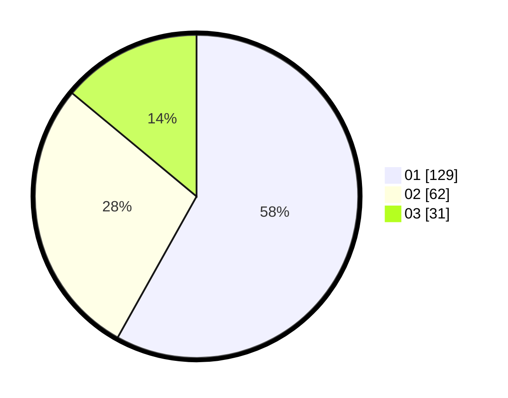

# Hasil

Hasil perolehan suara paslon dapat dilihat pada file paslon-01.txt, paslon-02.txt, dan paslon-03.txt.

Jika tidak ada, artinya data tersebut belum ada pada SIREKAP.

## Perolehan Suara

 * Paslon 01: **129**.
 * Paslon 02: **62**.
 * Paslon 03: **31**.

## Foto C Plano

https://sirekap-obj-formc.kpu.go.id/4571/pemilu/ppwp/31/75/04/10/02/3175041002142-20240215-182531--05ee13d8-c173-4e90-a807-e5b7b66e1014.jpg

https://sirekap-obj-formc.kpu.go.id/4571/pemilu/ppwp/31/75/04/10/02/3175041002142-20240215-182612--912339fb-f559-4882-8964-7b0fdc1e2b82.jpg

https://sirekap-obj-formc.kpu.go.id/4571/pemilu/ppwp/31/75/04/10/02/3175041002142-20240217-104116--af1181d9-f11f-4c32-8599-fc08a19338a2.jpg

## DATA PEMILIH TETAP

Jumlah pemilih dalam DPT: **269**.
 * L: **137**.
 * P: **132**.

## DATA PENGGUNA HAK PILIH

Jumlah pengguna hak pilih dalam DPT: **220**.
 * L: **103**.
 * P: **117**.

Jumlah pengguna hak pilih dalam DPTb: **2**.
 * L: **1**.
 * P: **1**.

Jumlah pengguna hak pilih dalam DPK: **2**.
 * L: **1**.
 * P: **1**.

Jumlah pengguna hak pilih: **224**.
 * L: **105**.
 * P: **119**.

## JUMLAH SUARA SAH DAN TIDAK SAH

JUMLAH SELURUH SUARA SAH: **222**.

JUMLAH SUARA TIDAK SAH: **2**.

JUMLAH SELURUH SUARA SAH DAN SUARA TIDAK SAH: **224**.
