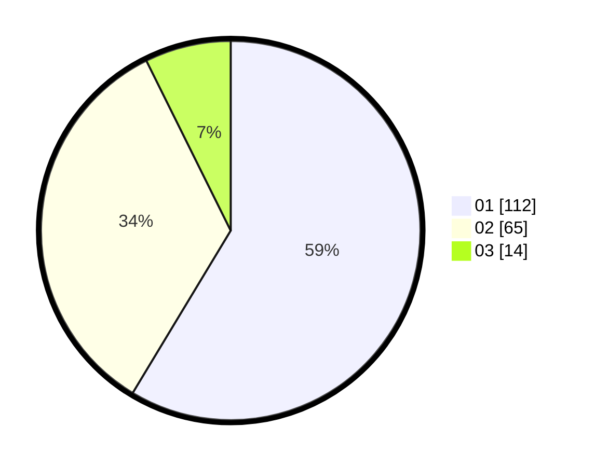

# Hasil

Hasil perolehan suara paslon dapat dilihat pada file paslon-01.txt, paslon-02.txt, dan paslon-03.txt.

Jika tidak ada, artinya data tersebut belum ada pada SIREKAP.

## Perolehan Suara

 * Paslon 01: **112**.
 * Paslon 02: **65**.
 * Paslon 03: **14**.

## Foto C Plano

https://sirekap-obj-formc.kpu.go.id/5099/pemilu/ppwp/31/75/04/10/03/3175041003002-20240219-093843--0637999b-d3bd-44af-bc58-1797e06f221d.jpg

https://sirekap-obj-formc.kpu.go.id/5099/pemilu/ppwp/31/75/04/10/03/3175041003002-20240219-093722--973cfc1e-8d0e-4bf7-a1e8-59f09c34c8ef.jpg

https://sirekap-obj-formc.kpu.go.id/5099/pemilu/ppwp/31/75/04/10/03/3175041003002-20240219-093545--36736021-6dc8-4867-ace4-3ab1b6e50b4f.jpg
