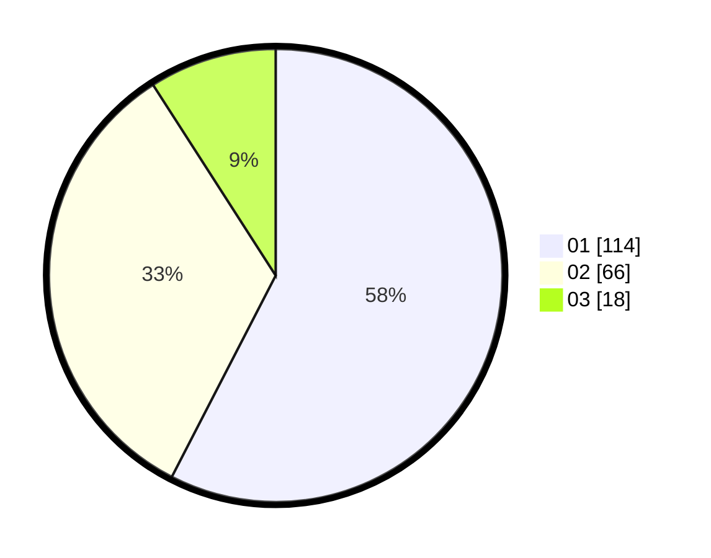

# Hasil

Hasil perolehan suara paslon dapat dilihat pada file paslon-01.txt, paslon-02.txt, dan paslon-03.txt.

Jika tidak ada, artinya data tersebut belum ada pada SIREKAP.

## Perolehan Suara

 * Paslon 01: **114**.
 * Paslon 02: **66**.
 * Paslon 03: **18**.

## Foto C Plano

https://sirekap-obj-formc.kpu.go.id/056c/pemilu/ppwp/31/75/04/10/03/3175041003003-20240214-155055--5d3f07d0-2043-4c7a-a8c7-83ae76a226c6.jpg

https://sirekap-obj-formc.kpu.go.id/056c/pemilu/ppwp/31/75/04/10/03/3175041003003-20240214-160100--e5e211f1-59b7-4b95-b30c-751f4deff283.jpg

https://sirekap-obj-formc.kpu.go.id/056c/pemilu/ppwp/31/75/04/10/03/3175041003003-20240214-190055--b49130a2-2436-4a90-936b-3f8d56754628.jpg

## DATA PEMILIH TETAP

Jumlah pemilih dalam DPT: **253**.
 * L: **120**.
 * P: **133**.

## DATA PENGGUNA HAK PILIH

Jumlah pengguna hak pilih dalam DPT: **196**.
 * L: **90**.
 * P: **106**.

Jumlah pengguna hak pilih dalam DPTb: **3**.
 * L: **0**.
 * P: **3**.

Jumlah pengguna hak pilih dalam DPK: **0**.
 * L: **0**.
 * P: **0**.

Jumlah pengguna hak pilih: **199**.
 * L: **90**.
 * P: **109**.

## JUMLAH SUARA SAH DAN TIDAK SAH

JUMLAH SELURUH SUARA SAH: **198**.

JUMLAH SUARA TIDAK SAH: **1**.

JUMLAH SELURUH SUARA SAH DAN SUARA TIDAK SAH: **199**.
