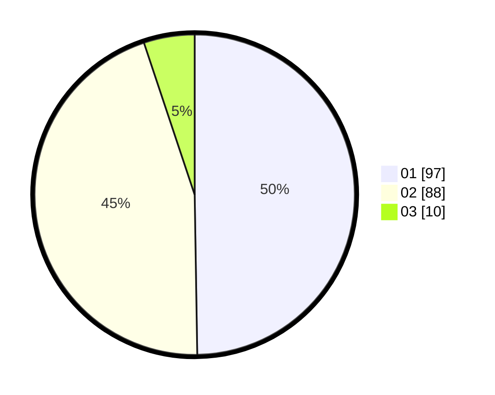

# Hasil

Hasil perolehan suara paslon dapat dilihat pada file paslon-01.txt, paslon-02.txt, dan paslon-03.txt.

Jika tidak ada, artinya data tersebut belum ada pada SIREKAP.

## Perolehan Suara

 * Paslon 01: **97**.
 * Paslon 02: **88**.
 * Paslon 03: **10**.

## Foto C Plano

https://sirekap-obj-formc.kpu.go.id/d957/pemilu/ppwp/31/75/04/10/03/3175041003004-20240214-155031--6f20a788-b19d-4880-a35c-d779764ae410.jpg

https://sirekap-obj-formc.kpu.go.id/d957/pemilu/ppwp/31/75/04/10/03/3175041003004-20240214-155115--dbc9e37b-40fb-490b-91ba-c9ff49e1f7d0.jpg

https://sirekap-obj-formc.kpu.go.id/d957/pemilu/ppwp/31/75/04/10/03/3175041003004-20240214-155144--3f548465-09eb-4437-9a3d-a6df627055ae.jpg

## DATA PEMILIH TETAP

Jumlah pemilih dalam DPT: **251**.
 * L: **123**.
 * P: **128**.

## DATA PENGGUNA HAK PILIH

Jumlah pengguna hak pilih dalam DPT: **194**.
 * L: **88**.
 * P: **106**.

Jumlah pengguna hak pilih dalam DPTb: **2**.
 * L: **1**.
 * P: **1**.

Jumlah pengguna hak pilih dalam DPK: **1**.
 * L: **0**.
 * P: **1**.

Jumlah pengguna hak pilih: **197**.
 * L: **89**.
 * P: **108**.

## JUMLAH SUARA SAH DAN TIDAK SAH

JUMLAH SELURUH SUARA SAH: **195**.

JUMLAH SUARA TIDAK SAH: **2**.

JUMLAH SELURUH SUARA SAH DAN SUARA TIDAK SAH: **197**.
