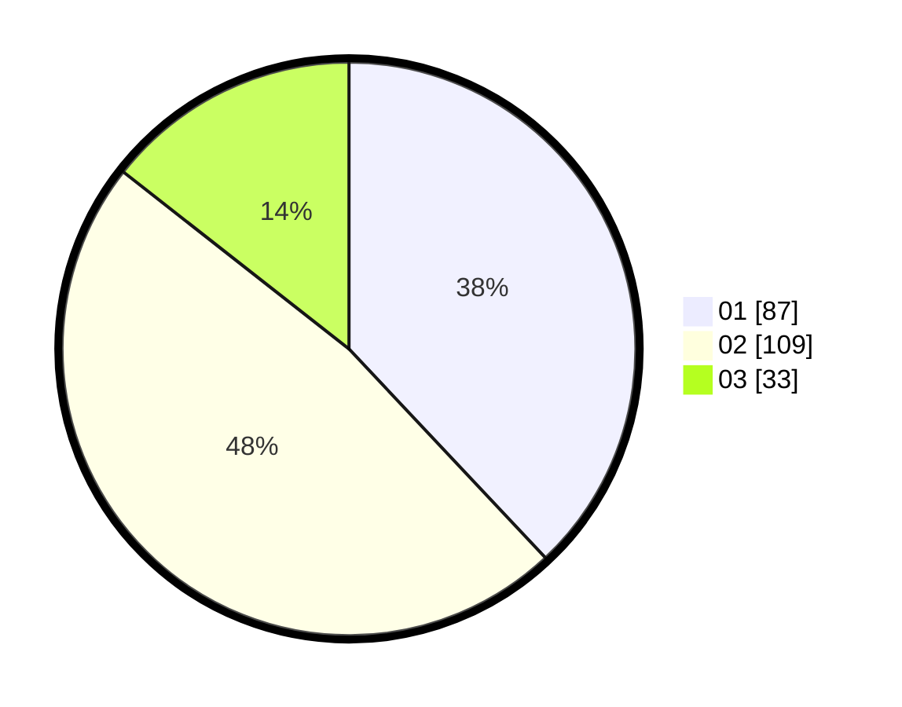

# Hasil

Hasil perolehan suara paslon dapat dilihat pada file paslon-01.txt, paslon-02.txt, dan paslon-03.txt.

Jika tidak ada, artinya data tersebut belum ada pada SIREKAP.

## Perolehan Suara

 * Paslon 01: **87**.
 * Paslon 02: **109**.
 * Paslon 03: **33**.

## Foto C Plano

https://sirekap-obj-formc.kpu.go.id/4d9a/pemilu/ppwp/31/75/04/10/03/3175041003010-20240218-201942--00834f90-4d19-4390-b5ff-21b9b7ac3b80.jpg

https://sirekap-obj-formc.kpu.go.id/4d9a/pemilu/ppwp/31/75/04/10/03/3175041003010-20240218-202034--a0fd701a-9bd2-49d8-80b0-616ace41c83d.jpg

https://sirekap-obj-formc.kpu.go.id/4d9a/pemilu/ppwp/31/75/04/10/03/3175041003010-20240218-201808--0c5300c0-657f-4caf-a324-7f6202f3d6de.jpg
