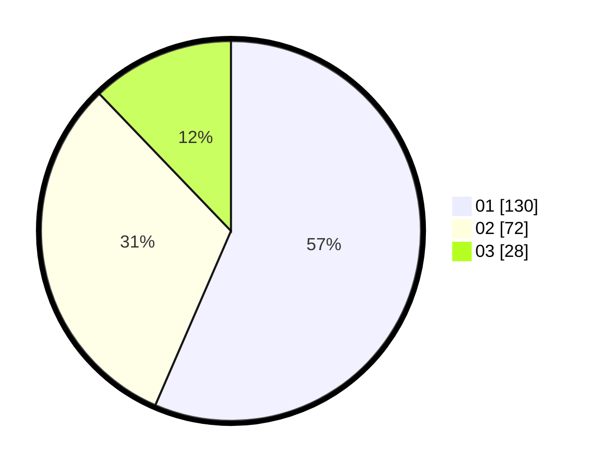

# Hasil

Hasil perolehan suara paslon dapat dilihat pada file paslon-01.txt, paslon-02.txt, dan paslon-03.txt.

Jika tidak ada, artinya data tersebut belum ada pada SIREKAP.

## Perolehan Suara

 * Paslon 01: **130**.
 * Paslon 02: **72**.
 * Paslon 03: **28**.

## Foto C Plano

https://sirekap-obj-formc.kpu.go.id/9fa6/pemilu/ppwp/31/75/04/10/03/3175041003011-20240215-214544--1add5653-87a5-4c0c-b592-6133310fc741.jpg

https://sirekap-obj-formc.kpu.go.id/9fa6/pemilu/ppwp/31/75/04/10/03/3175041003011-20240215-202409--10d66357-a638-42ca-8e47-c6918fa55192.jpg

https://sirekap-obj-formc.kpu.go.id/9fa6/pemilu/ppwp/31/75/04/10/03/3175041003011-20240215-204545--2745ef10-7ec6-432b-a72e-a0065e7445af.jpg

## DATA PEMILIH TETAP

Jumlah pemilih dalam DPT: **257**.
 * L: **122**.
 * P: **135**.

## DATA PENGGUNA HAK PILIH

Jumlah pengguna hak pilih dalam DPT: **226**.
 * L: **105**.
 * P: **121**.

Jumlah pengguna hak pilih dalam DPTb: **3**.
 * L: **2**.
 * P: **1**.

Jumlah pengguna hak pilih dalam DPK: **3**.
 * L: **2**.
 * P: **1**.

Jumlah pengguna hak pilih: **232**.
 * L: **109**.
 * P: **123**.

## JUMLAH SUARA SAH DAN TIDAK SAH

JUMLAH SELURUH SUARA SAH: **230**.

JUMLAH SUARA TIDAK SAH: **2**.

JUMLAH SELURUH SUARA SAH DAN SUARA TIDAK SAH: **232**.
