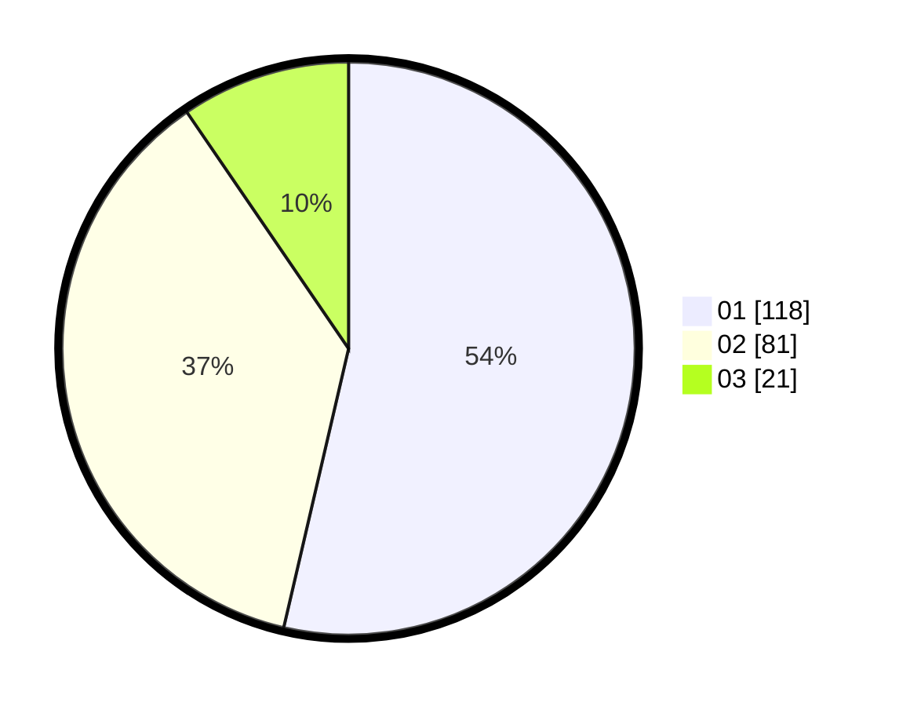

# Hasil

Hasil perolehan suara paslon dapat dilihat pada file paslon-01.txt, paslon-02.txt, dan paslon-03.txt.

Jika tidak ada, artinya data tersebut belum ada pada SIREKAP.

## Perolehan Suara

 * Paslon 01: **118**.
 * Paslon 02: **81**.
 * Paslon 03: **21**.

## Foto C Plano

https://sirekap-obj-formc.kpu.go.id/271f/pemilu/ppwp/31/75/04/10/03/3175041003017-20240215-100750--790a4486-c2f6-4ec1-a929-28656d9f60e3.jpg

https://sirekap-obj-formc.kpu.go.id/271f/pemilu/ppwp/31/75/04/10/03/3175041003017-20240215-102006--572e3e8a-361d-4a1a-b5a7-d11d813f84fa.jpg

https://sirekap-obj-formc.kpu.go.id/271f/pemilu/ppwp/31/75/04/10/03/3175041003017-20240216-051955--4b69e941-52f1-4365-bea8-257057f45c77.jpg

## DATA PEMILIH TETAP

Jumlah pemilih dalam DPT: **266**.
 * L: **135**.
 * P: **131**.

## DATA PENGGUNA HAK PILIH

Jumlah pengguna hak pilih dalam DPT: **211**.
 * L: **98**.
 * P: **113**.

Jumlah pengguna hak pilih dalam DPTb: **10**.
 * L: **5**.
 * P: **5**.

Jumlah pengguna hak pilih dalam DPK: **2**.
 * L: **1**.
 * P: **1**.

Jumlah pengguna hak pilih: **223**.
 * L: **104**.
 * P: **119**.

## JUMLAH SUARA SAH DAN TIDAK SAH

JUMLAH SELURUH SUARA SAH: **220**.

JUMLAH SUARA TIDAK SAH: **3**.

JUMLAH SELURUH SUARA SAH DAN SUARA TIDAK SAH: **223**.
