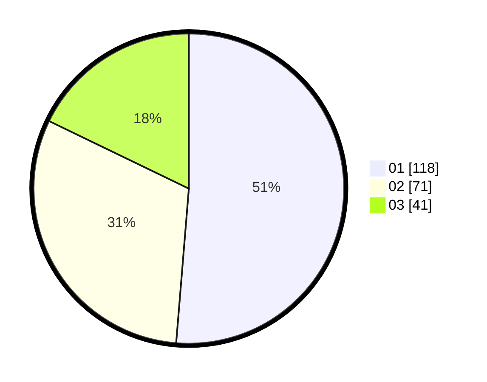

# Hasil

Hasil perolehan suara paslon dapat dilihat pada file paslon-01.txt, paslon-02.txt, dan paslon-03.txt.

Jika tidak ada, artinya data tersebut belum ada pada SIREKAP.

## Perolehan Suara

 * Paslon 01: **118**.
 * Paslon 02: **71**.
 * Paslon 03: **41**.

## Foto C Plano

https://sirekap-obj-formc.kpu.go.id/7301/pemilu/ppwp/31/75/04/10/03/3175041003018-20240215-020458--3132d833-41e3-4a38-90cd-283abbb7854e.jpg

https://sirekap-obj-formc.kpu.go.id/7301/pemilu/ppwp/31/75/04/10/03/3175041003018-20240215-020624--56a002bb-670f-496e-a7d3-0044f65c91a5.jpg

https://sirekap-obj-formc.kpu.go.id/7301/pemilu/ppwp/31/75/04/10/03/3175041003018-20240214-204646--2920dce9-295a-4a41-ba23-730ad55a4bd9.jpg
