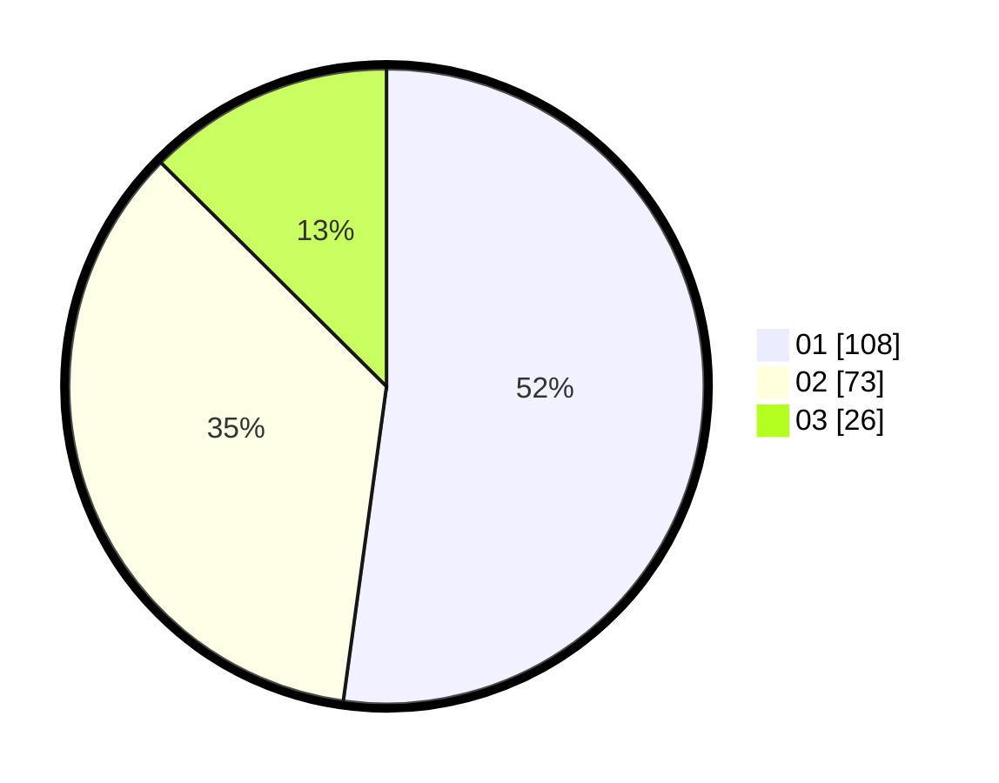

# Hasil

Hasil perolehan suara paslon dapat dilihat pada file paslon-01.txt, paslon-02.txt, dan paslon-03.txt.

Jika tidak ada, artinya data tersebut belum ada pada SIREKAP.

## Perolehan Suara

 * Paslon 01: **108**.
 * Paslon 02: **73**.
 * Paslon 03: **26**.

## Foto C Plano

https://sirekap-obj-formc.kpu.go.id/209d/pemilu/ppwp/31/75/04/10/03/3175041003023-20240216-132319--2281c096-ea7a-47e1-a2d2-d6d9950e5a64.jpg

https://sirekap-obj-formc.kpu.go.id/209d/pemilu/ppwp/31/75/04/10/03/3175041003023-20240216-132920--b233c86d-7aa8-406d-b92e-310bb8251e80.jpg

https://sirekap-obj-formc.kpu.go.id/209d/pemilu/ppwp/31/75/04/10/03/3175041003023-20240216-133108--23497e37-d705-4889-9d91-09e7e360d284.jpg

## DATA PEMILIH TETAP

Jumlah pemilih dalam DPT: **294**.
 * L: **140**.
 * P: **154**.

## DATA PENGGUNA HAK PILIH

Jumlah pengguna hak pilih dalam DPT: **206**.
 * L: **97**.
 * P: **109**.

Jumlah pengguna hak pilih dalam DPTb: **2**.
 * L: **1**.
 * P: **1**.

Jumlah pengguna hak pilih dalam DPK: **0**.
 * L: **0**.
 * P: **0**.

Jumlah pengguna hak pilih: **208**.
 * L: **98**.
 * P: **110**.

## JUMLAH SUARA SAH DAN TIDAK SAH

JUMLAH SELURUH SUARA SAH: **207**.

JUMLAH SUARA TIDAK SAH: **1**.

JUMLAH SELURUH SUARA SAH DAN SUARA TIDAK SAH: **208**.
