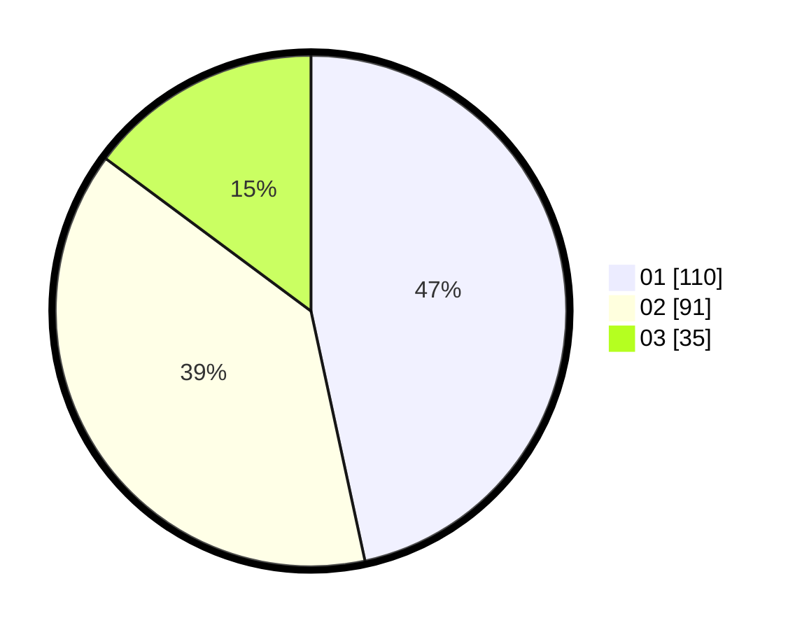

# Hasil

Hasil perolehan suara paslon dapat dilihat pada file paslon-01.txt, paslon-02.txt, dan paslon-03.txt.

Jika tidak ada, artinya data tersebut belum ada pada SIREKAP.

## Perolehan Suara

 * Paslon 01: **110**.
 * Paslon 02: **91**.
 * Paslon 03: **35**.

## Foto C Plano

https://sirekap-obj-formc.kpu.go.id/300e/pemilu/ppwp/31/75/04/10/03/3175041003024-20240214-213608--43ddb05f-a479-482b-8231-a11886caf894.jpg

https://sirekap-obj-formc.kpu.go.id/300e/pemilu/ppwp/31/75/04/10/03/3175041003024-20240214-213826--d6955784-f877-4d1b-b9f2-7a7b5a581be7.jpg

https://sirekap-obj-formc.kpu.go.id/300e/pemilu/ppwp/31/75/04/10/03/3175041003024-20240214-214012--ce5dd99d-878b-438e-8df1-741f3fd2a961.jpg

## DATA PEMILIH TETAP

Jumlah pemilih dalam DPT: **290**.
 * L: **144**.
 * P: **146**.

## DATA PENGGUNA HAK PILIH

Jumlah pengguna hak pilih dalam DPT: **240**.
 * L: **118**.
 * P: **122**.

Jumlah pengguna hak pilih dalam DPTb: **2**.
 * L: **2**.
 * P: **0**.

Jumlah pengguna hak pilih dalam DPK: **1**.
 * L: **1**.
 * P: **0**.

Jumlah pengguna hak pilih: **243**.
 * L: **121**.
 * P: **122**.

## JUMLAH SUARA SAH DAN TIDAK SAH

JUMLAH SELURUH SUARA SAH: **236**.

JUMLAH SUARA TIDAK SAH: **7**.

JUMLAH SELURUH SUARA SAH DAN SUARA TIDAK SAH: **243**.
