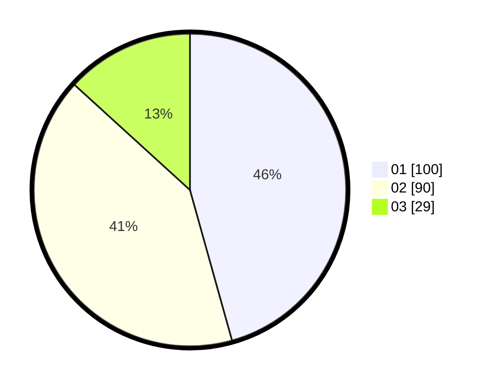

# Hasil

Hasil perolehan suara paslon dapat dilihat pada file paslon-01.txt, paslon-02.txt, dan paslon-03.txt.

Jika tidak ada, artinya data tersebut belum ada pada SIREKAP.

## Perolehan Suara

 * Paslon 01: **100**.
 * Paslon 02: **90**.
 * Paslon 03: **29**.

## Foto C Plano

https://sirekap-obj-formc.kpu.go.id/0a3c/pemilu/ppwp/31/75/04/10/03/3175041003025-20240214-222457--809e989e-8a03-467c-a1bd-0aa53a52df37.jpg

https://sirekap-obj-formc.kpu.go.id/0a3c/pemilu/ppwp/31/75/04/10/03/3175041003025-20240214-222620--1fb26a4e-2aca-45cd-a6a8-0a6bb2fa7b92.jpg

https://sirekap-obj-formc.kpu.go.id/0a3c/pemilu/ppwp/31/75/04/10/03/3175041003025-20240214-201637--3d608e02-029f-4bc0-b955-abcd814f93d9.jpg
