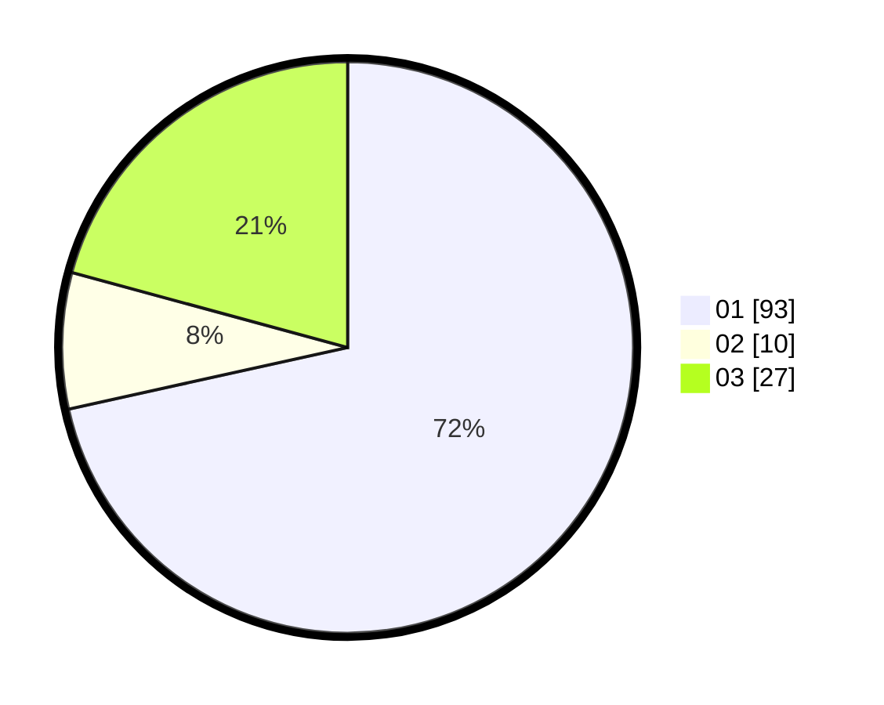

# Hasil

Hasil perolehan suara paslon dapat dilihat pada file paslon-01.txt, paslon-02.txt, dan paslon-03.txt.

Jika tidak ada, artinya data tersebut belum ada pada SIREKAP.

## Perolehan Suara

 * Paslon 01: **93**.
 * Paslon 02: **10**.
 * Paslon 03: **27**.

## Foto C Plano

https://sirekap-obj-formc.kpu.go.id/06ff/pemilu/ppwp/31/75/04/10/03/3175041003029-20240214-215034--dbca2e3a-0ebf-4f2e-8b6e-4315674063a3.jpg

https://sirekap-obj-formc.kpu.go.id/06ff/pemilu/ppwp/31/75/04/10/03/3175041003029-20240214-215240--78e7d1f0-1eaf-4691-a5be-4406bc028b3d.jpg

https://sirekap-obj-formc.kpu.go.id/06ff/pemilu/ppwp/31/75/04/10/03/3175041003029-20240214-215433--fa33d29a-93bd-40b4-857c-c555056263c9.jpg
