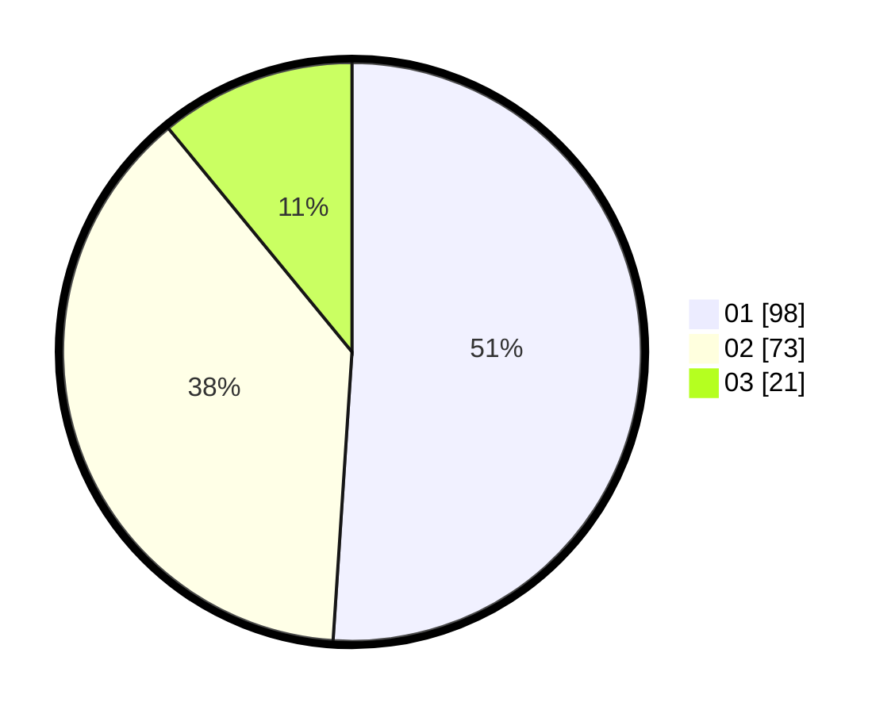

# Hasil

Hasil perolehan suara paslon dapat dilihat pada file paslon-01.txt, paslon-02.txt, dan paslon-03.txt.

Jika tidak ada, artinya data tersebut belum ada pada SIREKAP.

## Perolehan Suara

 * Paslon 01: **98**.
 * Paslon 02: **73**.
 * Paslon 03: **21**.

## Foto C Plano

https://sirekap-obj-formc.kpu.go.id/2f02/pemilu/ppwp/31/75/04/10/03/3175041003030-20240215-001409--c8eeefd4-322a-4f4d-ac57-0fae1544706b.jpg

https://sirekap-obj-formc.kpu.go.id/2f02/pemilu/ppwp/31/75/04/10/03/3175041003030-20240214-192304--763a285c-d7d5-426a-96a2-eaff2a2a2426.jpg

https://sirekap-obj-formc.kpu.go.id/2f02/pemilu/ppwp/31/75/04/10/03/3175041003030-20240214-192316--c535889b-4d1d-4915-b9ed-926b757dd27f.jpg
