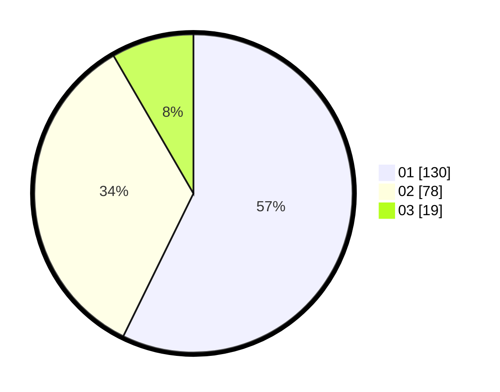

# Hasil

Hasil perolehan suara paslon dapat dilihat pada file paslon-01.txt, paslon-02.txt, dan paslon-03.txt.

Jika tidak ada, artinya data tersebut belum ada pada SIREKAP.

## Perolehan Suara

 * Paslon 01: **130**.
 * Paslon 02: **78**.
 * Paslon 03: **19**.

## Foto C Plano

https://sirekap-obj-formc.kpu.go.id/490f/pemilu/ppwp/31/75/04/10/03/3175041003033-20240215-150311--b150c2c4-e8c7-4485-9b06-ffb7cd146141.jpg

https://sirekap-obj-formc.kpu.go.id/490f/pemilu/ppwp/31/75/04/10/03/3175041003033-20240214-221503--bde6c20c-7f2d-4f29-b7e1-6b63d332a300.jpg

https://sirekap-obj-formc.kpu.go.id/490f/pemilu/ppwp/31/75/04/10/03/3175041003033-20240214-221617--0ac0cc6b-32a0-49f2-bf86-921bdc6cf6b5.jpg
