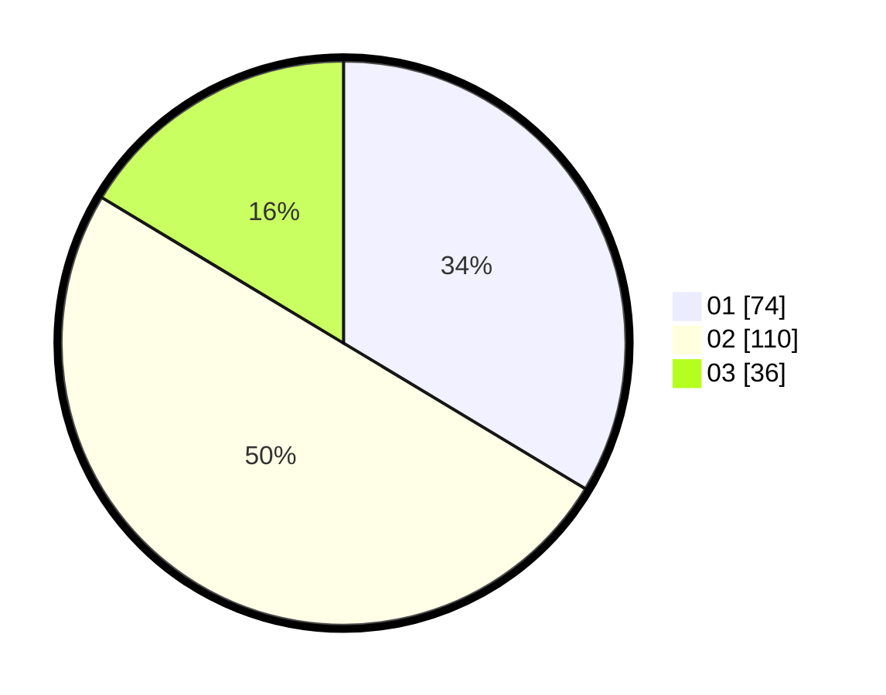

# Hasil

Hasil perolehan suara paslon dapat dilihat pada file paslon-01.txt, paslon-02.txt, dan paslon-03.txt.

Jika tidak ada, artinya data tersebut belum ada pada SIREKAP.

## Perolehan Suara

 * Paslon 01: **74**.
 * Paslon 02: **110**.
 * Paslon 03: **36**.

## Foto C Plano

https://sirekap-obj-formc.kpu.go.id/ae8e/pemilu/ppwp/31/75/04/10/03/3175041003034-20240214-214357--d2d65a85-fe71-4b45-9065-724c508ac7c6.jpg

https://sirekap-obj-formc.kpu.go.id/ae8e/pemilu/ppwp/31/75/04/10/03/3175041003034-20240214-214451--6917d0b0-0f99-4c0d-b465-305f4442b217.jpg

https://sirekap-obj-formc.kpu.go.id/ae8e/pemilu/ppwp/31/75/04/10/03/3175041003034-20240214-214553--d95c0347-5af2-4650-adc4-71ab2d4aac39.jpg

## DATA PEMILIH TETAP

Jumlah pemilih dalam DPT: **280**.
 * L: **138**.
 * P: **142**.

## DATA PENGGUNA HAK PILIH

Jumlah pengguna hak pilih dalam DPT: **229**.
 * L: **105**.
 * P: **124**.

Jumlah pengguna hak pilih dalam DPTb: **2**.
 * L: **1**.
 * P: **1**.

Jumlah pengguna hak pilih dalam DPK: **0**.
 * L: **0**.
 * P: **0**.

Jumlah pengguna hak pilih: **231**.
 * L: **106**.
 * P: **125**.

## JUMLAH SUARA SAH DAN TIDAK SAH

JUMLAH SELURUH SUARA SAH: **220**.

JUMLAH SUARA TIDAK SAH: **11**.

JUMLAH SELURUH SUARA SAH DAN SUARA TIDAK SAH: **231**.
