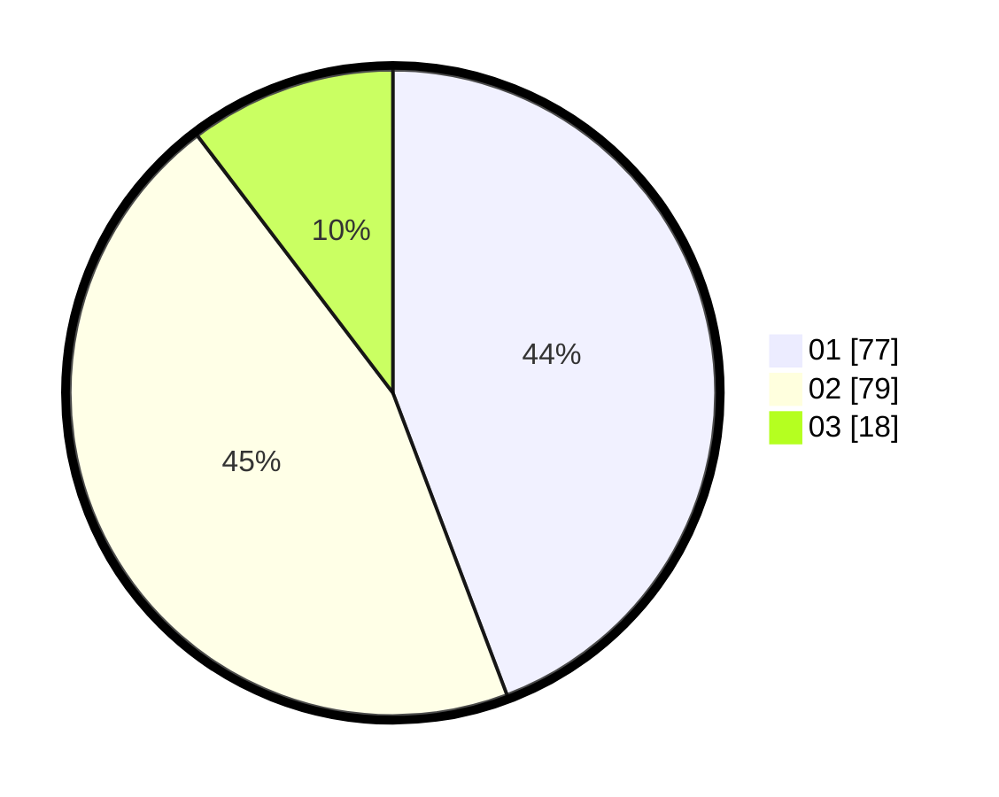

# Hasil

Hasil perolehan suara paslon dapat dilihat pada file paslon-01.txt, paslon-02.txt, dan paslon-03.txt.

Jika tidak ada, artinya data tersebut belum ada pada SIREKAP.

## Perolehan Suara

 * Paslon 01: **77**.
 * Paslon 02: **79**.
 * Paslon 03: **18**.

## Foto C Plano

https://sirekap-obj-formc.kpu.go.id/853e/pemilu/ppwp/31/75/04/10/03/3175041003042-20240214-235536--35fdea95-9666-470d-a8ea-e710b29e5593.jpg

https://sirekap-obj-formc.kpu.go.id/853e/pemilu/ppwp/31/75/04/10/03/3175041003042-20240214-234706--c5726019-e886-42bd-b26a-0137473b07a1.jpg

https://sirekap-obj-formc.kpu.go.id/853e/pemilu/ppwp/31/75/04/10/03/3175041003042-20240214-235927--9bf762ec-c8d1-4844-869c-2127cb0879ae.jpg
