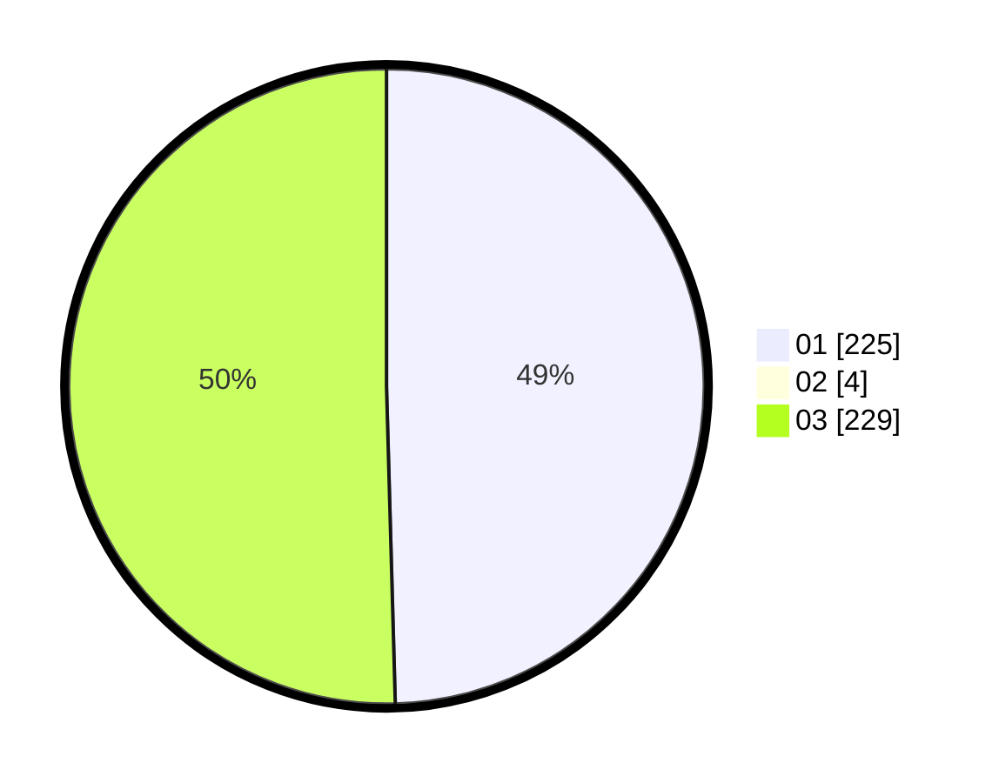

# Hasil

Hasil perolehan suara paslon dapat dilihat pada file paslon-01.txt, paslon-02.txt, dan paslon-03.txt.

Jika tidak ada, artinya data tersebut belum ada pada SIREKAP.

## Perolehan Suara

 * Paslon 01: **225**.
 * Paslon 02: **4**.
 * Paslon 03: **229**.

## Foto C Plano

https://sirekap-obj-formc.kpu.go.id/aafa/pemilu/ppwp/31/75/04/10/03/3175041003046-20240214-190611--61892a49-eacf-40e2-ad7f-1319becc753f.jpg

https://sirekap-obj-formc.kpu.go.id/aafa/pemilu/ppwp/31/75/04/10/03/3175041003046-20240214-190909--fda6b6a0-184f-4929-9b76-d2d9810ef93c.jpg

https://sirekap-obj-formc.kpu.go.id/aafa/pemilu/ppwp/31/75/04/10/03/3175041003046-20240214-190731--7604c64a-bee1-44db-91eb-d02c61fa1cac.jpg
