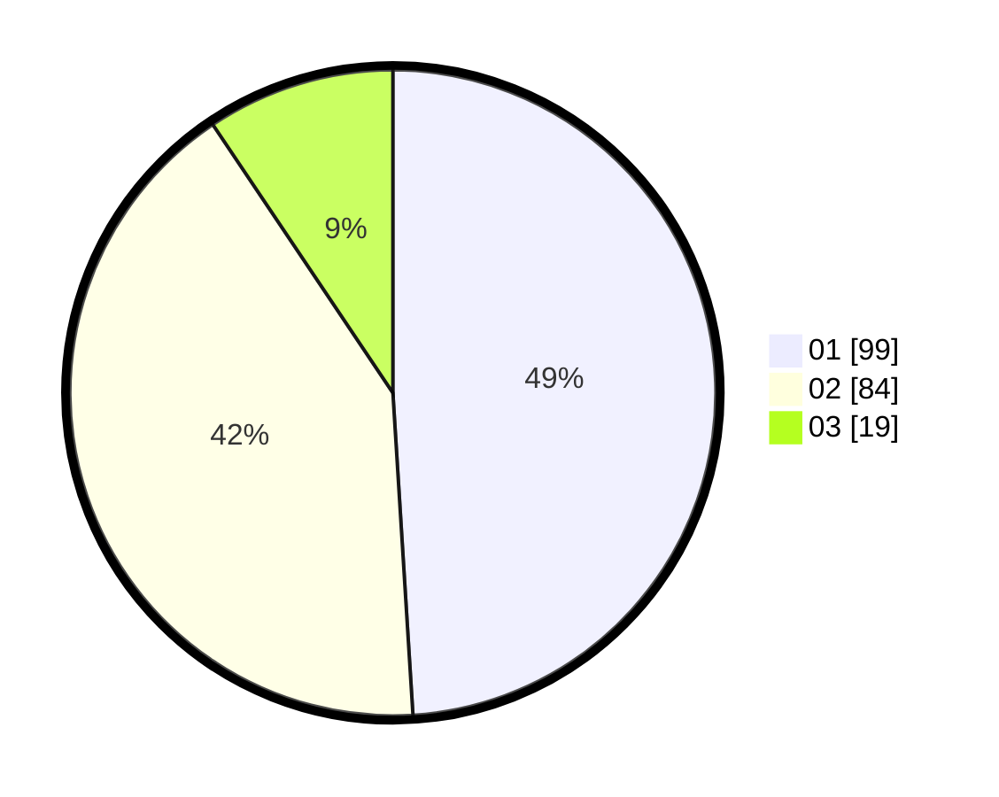

# Hasil

Hasil perolehan suara paslon dapat dilihat pada file paslon-01.txt, paslon-02.txt, dan paslon-03.txt.

Jika tidak ada, artinya data tersebut belum ada pada SIREKAP.

## Perolehan Suara

 * Paslon 01: **99**.
 * Paslon 02: **84**.
 * Paslon 03: **19**.

## Foto C Plano

https://sirekap-obj-formc.kpu.go.id/3692/pemilu/ppwp/31/75/04/10/03/3175041003047-20240215-004611--f22cb7d7-1beb-40e3-9be6-ccd72ceb6dba.jpg

https://sirekap-obj-formc.kpu.go.id/3692/pemilu/ppwp/31/75/04/10/03/3175041003047-20240214-235331--ba549046-de72-46c5-b96d-0da6f5c7e5b6.jpg

https://sirekap-obj-formc.kpu.go.id/3692/pemilu/ppwp/31/75/04/10/03/3175041003047-20240214-235454--3f983a6c-5f32-406f-8716-b210188b034b.jpg
