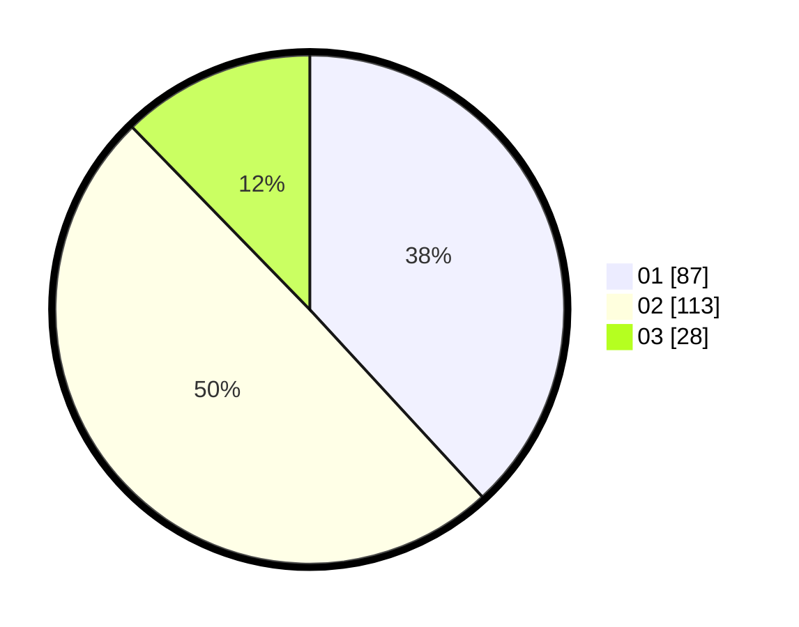

# Hasil

Hasil perolehan suara paslon dapat dilihat pada file paslon-01.txt, paslon-02.txt, dan paslon-03.txt.

Jika tidak ada, artinya data tersebut belum ada pada SIREKAP.

## Perolehan Suara

 * Paslon 01: **87**.
 * Paslon 02: **113**.
 * Paslon 03: **28**.

## Foto C Plano

https://sirekap-obj-formc.kpu.go.id/719c/pemilu/ppwp/31/75/04/10/03/3175041003049-20240216-190028--c7026917-2abb-49ed-93ea-de5446580cd4.jpg

https://sirekap-obj-formc.kpu.go.id/719c/pemilu/ppwp/31/75/04/10/03/3175041003049-20240216-190219--326eae3d-5b6f-443c-b723-51200561b3f3.jpg

https://sirekap-obj-formc.kpu.go.id/719c/pemilu/ppwp/31/75/04/10/03/3175041003049-20240216-190332--0271bc04-bccf-46c9-a2d9-d8217efff13c.jpg

## DATA PEMILIH TETAP

Jumlah pemilih dalam DPT: **224**.
 * L: **113**.
 * P: **111**.

## DATA PENGGUNA HAK PILIH

Jumlah pengguna hak pilih dalam DPT: **224**.
 * L: **113**.
 * P: **111**.

Jumlah pengguna hak pilih dalam DPTb: **6**.
 * L: **3**.
 * P: **3**.

Jumlah pengguna hak pilih dalam DPK: **1**.
 * L: **0**.
 * P: **1**.

Jumlah pengguna hak pilih: **231**.
 * L: **116**.
 * P: **115**.

## JUMLAH SUARA SAH DAN TIDAK SAH

JUMLAH SELURUH SUARA SAH: **228**.

JUMLAH SUARA TIDAK SAH: **3**.

JUMLAH SELURUH SUARA SAH DAN SUARA TIDAK SAH: **231**.
