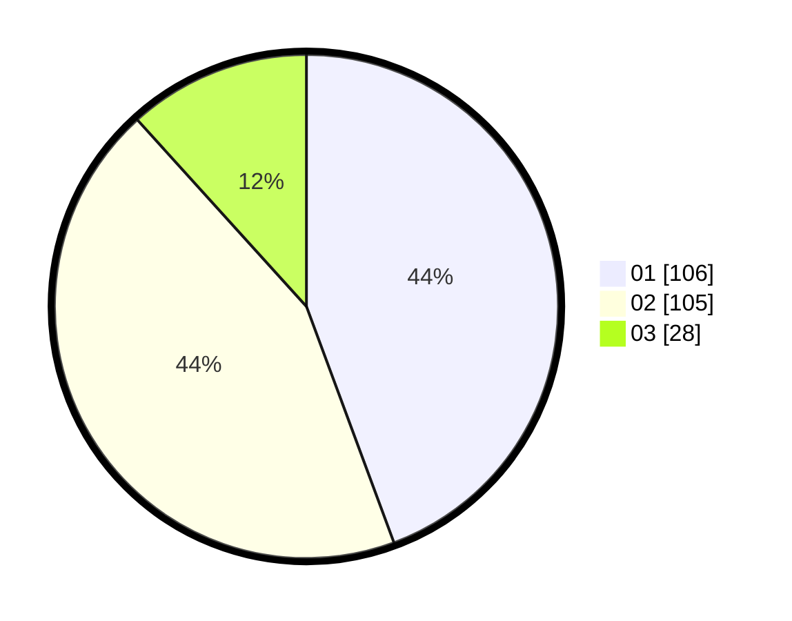

# Hasil

Hasil perolehan suara paslon dapat dilihat pada file paslon-01.txt, paslon-02.txt, dan paslon-03.txt.

Jika tidak ada, artinya data tersebut belum ada pada SIREKAP.

## Perolehan Suara

 * Paslon 01: **106**.
 * Paslon 02: **105**.
 * Paslon 03: **28**.

## Foto C Plano

https://sirekap-obj-formc.kpu.go.id/9377/pemilu/ppwp/31/75/04/10/03/3175041003052-20240214-222025--956481d8-b97f-43b7-a80a-5745b9712968.jpg

https://sirekap-obj-formc.kpu.go.id/9377/pemilu/ppwp/31/75/04/10/03/3175041003052-20240214-222400--e62fc47c-55d2-4e6e-b18c-17ef5cdfbe4f.jpg

https://sirekap-obj-formc.kpu.go.id/9377/pemilu/ppwp/31/75/04/10/03/3175041003052-20240214-222652--c5380365-b57e-4fdb-9e3e-121d3c4c75f8.jpg

## DATA PEMILIH TETAP

Jumlah pemilih dalam DPT: **280**.
 * L: **145**.
 * P: **135**.

## DATA PENGGUNA HAK PILIH

Jumlah pengguna hak pilih dalam DPT: **232**.
 * L: **118**.
 * P: **114**.

Jumlah pengguna hak pilih dalam DPTb: **2**.
 * L: **1**.
 * P: **1**.

Jumlah pengguna hak pilih dalam DPK: **7**.
 * L: **2**.
 * P: **5**.

Jumlah pengguna hak pilih: **241**.
 * L: **121**.
 * P: **120**.

## JUMLAH SUARA SAH DAN TIDAK SAH

JUMLAH SELURUH SUARA SAH: **239**.

JUMLAH SUARA TIDAK SAH: **2**.

JUMLAH SELURUH SUARA SAH DAN SUARA TIDAK SAH: **241**.
