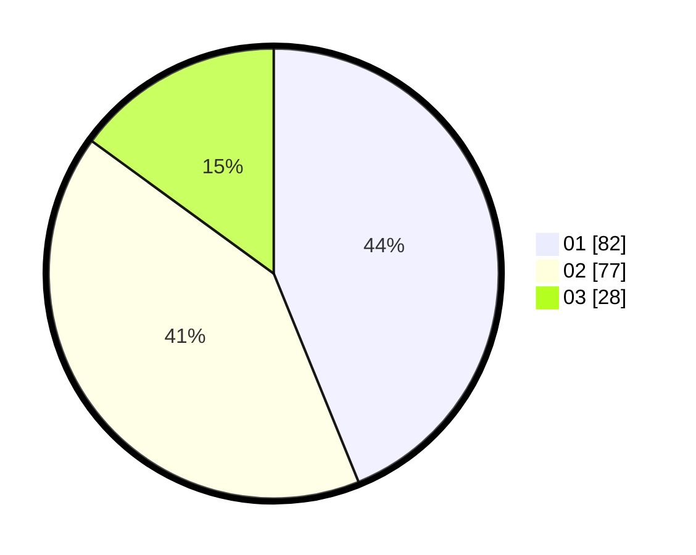

# Hasil

Hasil perolehan suara paslon dapat dilihat pada file paslon-01.txt, paslon-02.txt, dan paslon-03.txt.

Jika tidak ada, artinya data tersebut belum ada pada SIREKAP.

## Perolehan Suara

 * Paslon 01: **82**.
 * Paslon 02: **77**.
 * Paslon 03: **28**.

## Foto C Plano

https://sirekap-obj-formc.kpu.go.id/1f50/pemilu/ppwp/31/75/04/10/03/3175041003059-20240215-002410--b172125c-b8f5-4bfc-a073-d589356887d7.jpg

https://sirekap-obj-formc.kpu.go.id/1f50/pemilu/ppwp/31/75/04/10/03/3175041003059-20240215-002257--993aeaa1-d363-44bb-843a-46dfcc1e9129.jpg

https://sirekap-obj-formc.kpu.go.id/1f50/pemilu/ppwp/31/75/04/10/03/3175041003059-20240215-002151--1fed7cb1-169e-4777-99ee-d763a25520a0.jpg

## DATA PEMILIH TETAP

Jumlah pemilih dalam DPT: **256**.
 * L: **125**.
 * P: **131**.

## DATA PENGGUNA HAK PILIH

Jumlah pengguna hak pilih dalam DPT: **182**.
 * L: **79**.
 * P: **103**.

Jumlah pengguna hak pilih dalam DPTb: **6**.
 * L: **3**.
 * P: **3**.

Jumlah pengguna hak pilih dalam DPK: **2**.
 * L: **1**.
 * P: **1**.

Jumlah pengguna hak pilih: **190**.
 * L: **83**.
 * P: **107**.

## JUMLAH SUARA SAH DAN TIDAK SAH

JUMLAH SELURUH SUARA SAH: **187**.

JUMLAH SUARA TIDAK SAH: **3**.

JUMLAH SELURUH SUARA SAH DAN SUARA TIDAK SAH: **190**.
