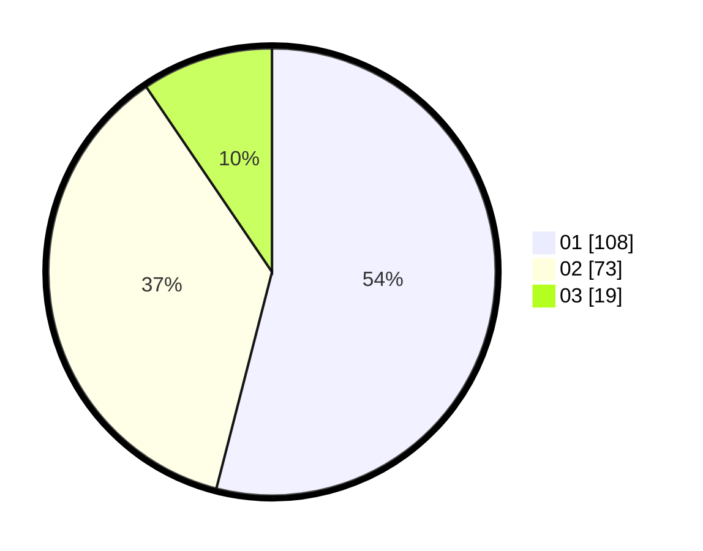

# Hasil

Hasil perolehan suara paslon dapat dilihat pada file paslon-01.txt, paslon-02.txt, dan paslon-03.txt.

Jika tidak ada, artinya data tersebut belum ada pada SIREKAP.

## Perolehan Suara

 * Paslon 01: **108**.
 * Paslon 02: **73**.
 * Paslon 03: **19**.

## Foto C Plano

https://sirekap-obj-formc.kpu.go.id/b56c/pemilu/ppwp/31/75/04/10/03/3175041003061-20240215-024452--fbb35ccf-f859-4612-8161-8b6cce74b02b.jpg

https://sirekap-obj-formc.kpu.go.id/b56c/pemilu/ppwp/31/75/04/10/03/3175041003061-20240215-024557--a2dca1fe-b4fd-423e-968e-c451d96b1891.jpg

https://sirekap-obj-formc.kpu.go.id/b56c/pemilu/ppwp/31/75/04/10/03/3175041003061-20240215-024708--3bef1433-428c-4350-83ef-dfc78a270bea.jpg
