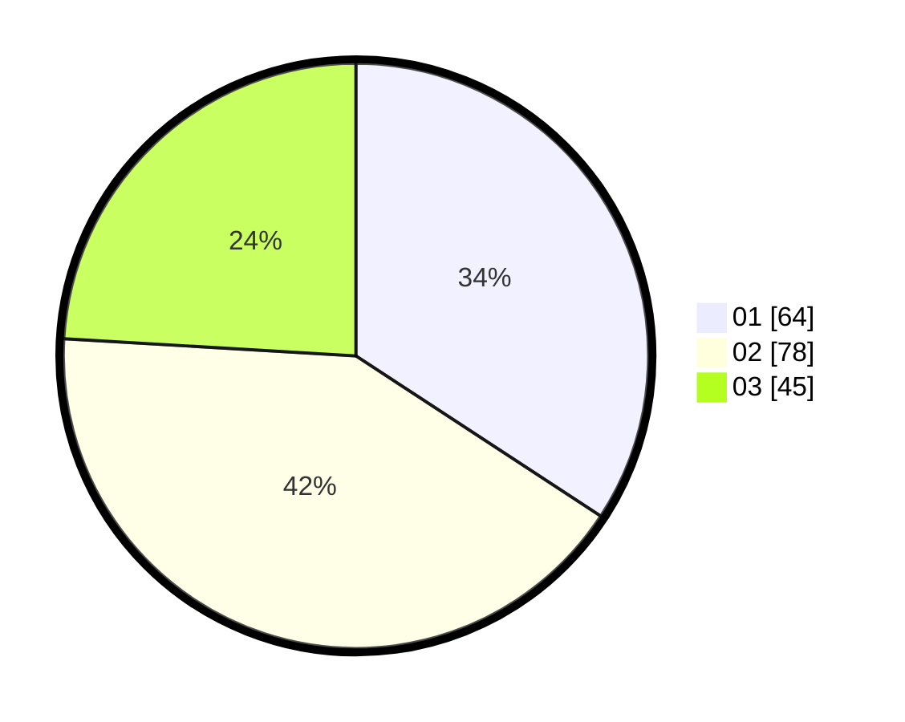

# Hasil

Hasil perolehan suara paslon dapat dilihat pada file paslon-01.txt, paslon-02.txt, dan paslon-03.txt.

Jika tidak ada, artinya data tersebut belum ada pada SIREKAP.

## Perolehan Suara

 * Paslon 01: **64**.
 * Paslon 02: **78**.
 * Paslon 03: **45**.

## Foto C Plano

https://sirekap-obj-formc.kpu.go.id/dfa2/pemilu/ppwp/31/75/04/10/03/3175041003075-20240214-233907--18d4db4d-8b68-4817-9dce-fe4b06e6b766.jpg

https://sirekap-obj-formc.kpu.go.id/dfa2/pemilu/ppwp/31/75/04/10/03/3175041003075-20240214-233951--857246ab-b07d-49d4-8a08-479f67e7a2a3.jpg

https://sirekap-obj-formc.kpu.go.id/dfa2/pemilu/ppwp/31/75/04/10/03/3175041003075-20240214-234036--a8a45c70-8322-4f3d-bd2b-4cf6da4c913d.jpg
