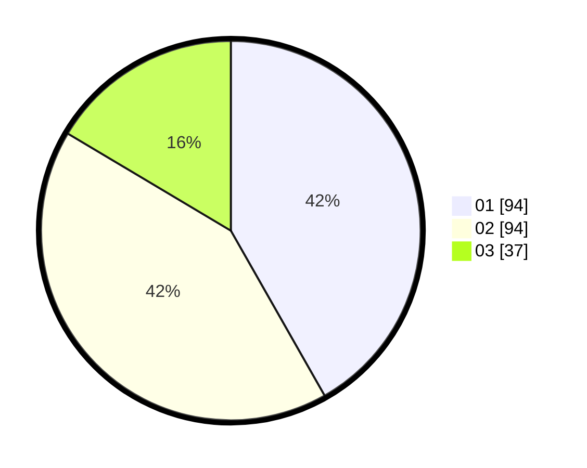

# Hasil

Hasil perolehan suara paslon dapat dilihat pada file paslon-01.txt, paslon-02.txt, dan paslon-03.txt.

Jika tidak ada, artinya data tersebut belum ada pada SIREKAP.

## Perolehan Suara

 * Paslon 01: **94**.
 * Paslon 02: **94**.
 * Paslon 03: **37**.

## Foto C Plano

https://sirekap-obj-formc.kpu.go.id/3a7e/pemilu/ppwp/31/75/04/10/03/3175041003076-20240214-175304--c58b0b99-6c6a-4551-bf93-caf7bf642b0c.jpg

https://sirekap-obj-formc.kpu.go.id/3a7e/pemilu/ppwp/31/75/04/10/03/3175041003076-20240214-155341--008dd60c-61a3-4c8a-9771-0f2ddbf55d64.jpg

https://sirekap-obj-formc.kpu.go.id/3a7e/pemilu/ppwp/31/75/04/10/03/3175041003076-20240214-155348--28ec439f-7847-4cde-9fd2-5caea7fe9bf9.jpg

## DATA PEMILIH TETAP

Jumlah pemilih dalam DPT: **265**.
 * L: **122**.
 * P: **143**.

## DATA PENGGUNA HAK PILIH

Jumlah pengguna hak pilih dalam DPT: **221**.
 * L: **94**.
 * P: **127**.

Jumlah pengguna hak pilih dalam DPTb: **5**.
 * L: **3**.
 * P: **2**.

Jumlah pengguna hak pilih dalam DPK: **1**.
 * L: **1**.
 * P: **0**.

Jumlah pengguna hak pilih: **227**.
 * L: **98**.
 * P: **129**.

## JUMLAH SUARA SAH DAN TIDAK SAH

JUMLAH SELURUH SUARA SAH: **225**.

JUMLAH SUARA TIDAK SAH: **2**.

JUMLAH SELURUH SUARA SAH DAN SUARA TIDAK SAH: **227**.
