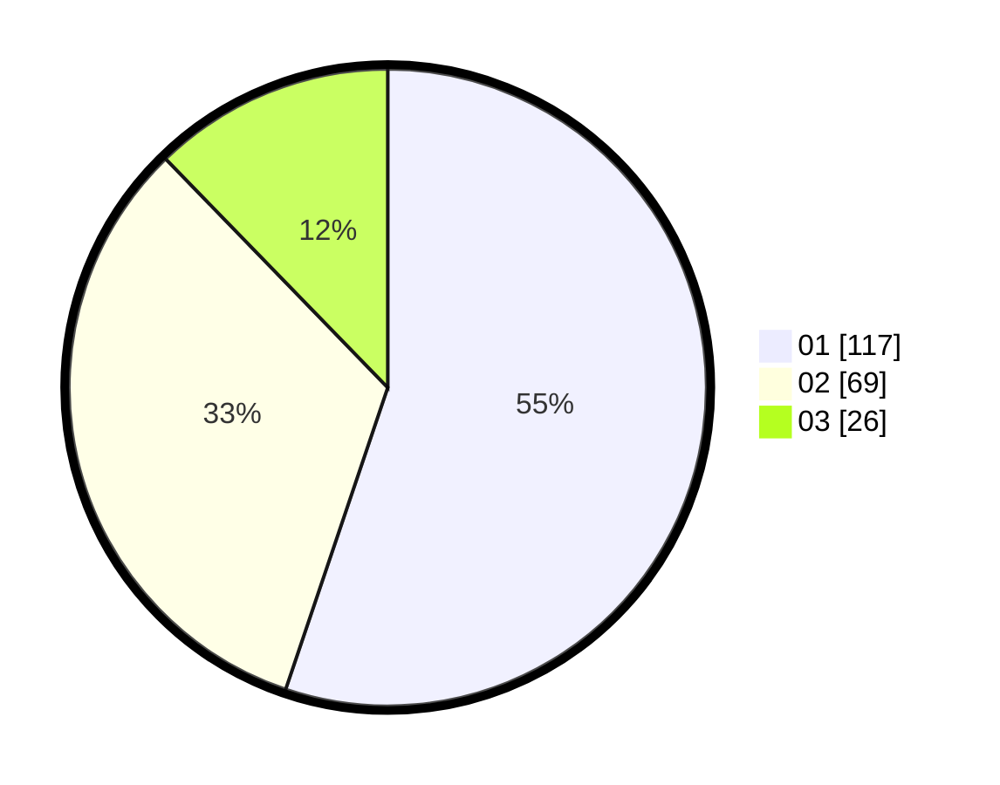

# Hasil

Hasil perolehan suara paslon dapat dilihat pada file paslon-01.txt, paslon-02.txt, dan paslon-03.txt.

Jika tidak ada, artinya data tersebut belum ada pada SIREKAP.

## Perolehan Suara

 * Paslon 01: **117**.
 * Paslon 02: **69**.
 * Paslon 03: **26**.

## Foto C Plano

https://sirekap-obj-formc.kpu.go.id/134d/pemilu/ppwp/31/75/04/10/03/3175041003078-20240214-195826--a0389a84-40bf-481e-b38a-467542227118.jpg

https://sirekap-obj-formc.kpu.go.id/134d/pemilu/ppwp/31/75/04/10/03/3175041003078-20240214-195835--c9f36220-fb8a-4655-a2e6-ba5b0a150747.jpg

https://sirekap-obj-formc.kpu.go.id/134d/pemilu/ppwp/31/75/04/10/03/3175041003078-20240214-195841--b0c8483a-5084-4dc8-aab7-a2bd57febbd9.jpg
