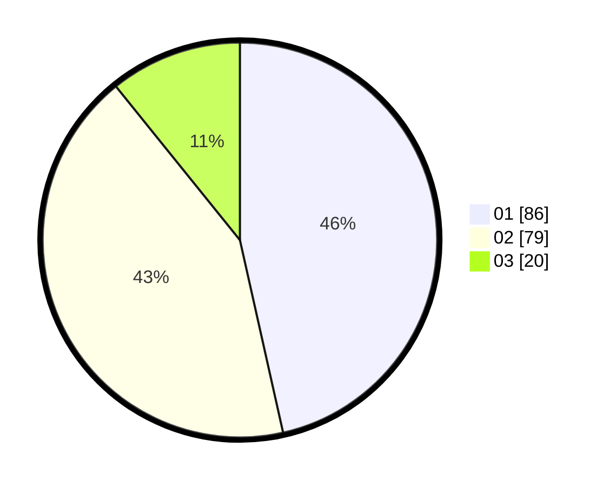

# Hasil

Hasil perolehan suara paslon dapat dilihat pada file paslon-01.txt, paslon-02.txt, dan paslon-03.txt.

Jika tidak ada, artinya data tersebut belum ada pada SIREKAP.

## Perolehan Suara

 * Paslon 01: **86**.
 * Paslon 02: **79**.
 * Paslon 03: **20**.

## Foto C Plano

https://sirekap-obj-formc.kpu.go.id/424c/pemilu/ppwp/31/75/04/10/03/3175041003079-20240214-234555--732e2020-ba21-4fcf-8773-2bf7d109efd2.jpg

https://sirekap-obj-formc.kpu.go.id/424c/pemilu/ppwp/31/75/04/10/03/3175041003079-20240214-234640--002114b2-045f-4881-ba2e-06da869eecbd.jpg

https://sirekap-obj-formc.kpu.go.id/424c/pemilu/ppwp/31/75/04/10/03/3175041003079-20240214-234732--8b1c6ee8-6f34-4650-916e-91281d122450.jpg
