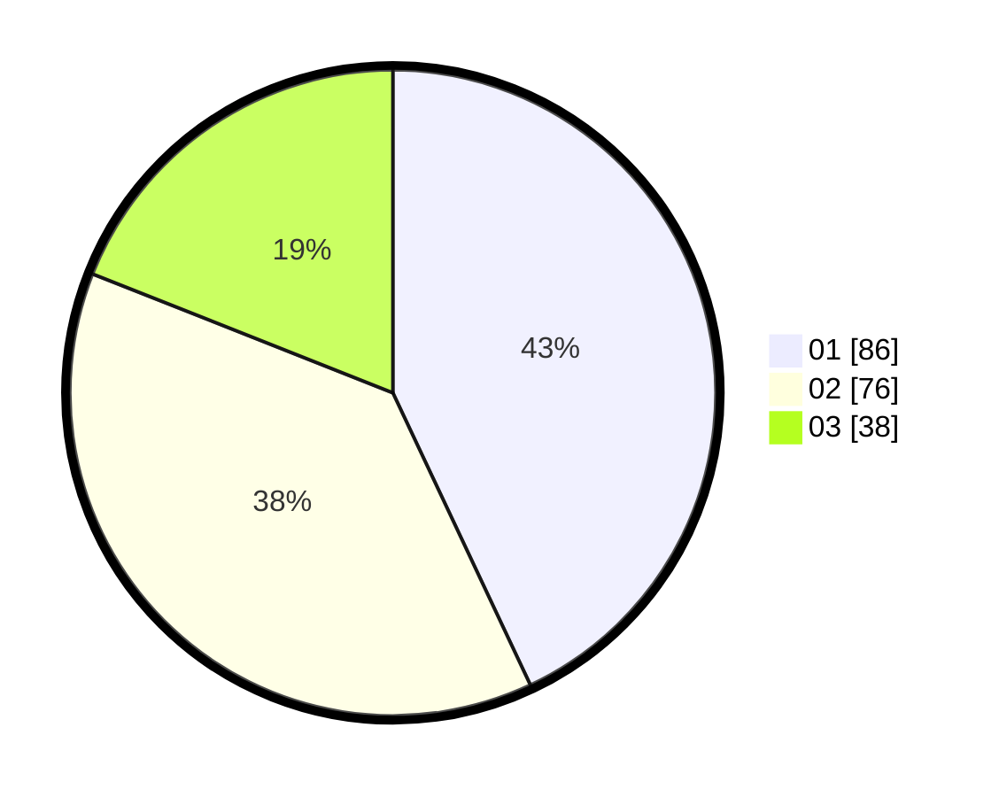

# Hasil

Hasil perolehan suara paslon dapat dilihat pada file paslon-01.txt, paslon-02.txt, dan paslon-03.txt.

Jika tidak ada, artinya data tersebut belum ada pada SIREKAP.

## Perolehan Suara

 * Paslon 01: **86**.
 * Paslon 02: **76**.
 * Paslon 03: **38**.

## Foto C Plano

https://sirekap-obj-formc.kpu.go.id/21fb/pemilu/ppwp/31/75/04/10/03/3175041003080-20240214-192606--dafb1133-0bc2-4366-8086-90b671223b04.jpg

https://sirekap-obj-formc.kpu.go.id/21fb/pemilu/ppwp/31/75/04/10/03/3175041003080-20240214-155510--fa03cf8d-9de4-4342-bc09-0b6f2f140cd6.jpg

https://sirekap-obj-formc.kpu.go.id/21fb/pemilu/ppwp/31/75/04/10/03/3175041003080-20240214-155700--35600c6f-b04d-4f33-a71a-ddb72f21fd10.jpg

## DATA PEMILIH TETAP

Jumlah pemilih dalam DPT: **277**.
 * L: **146**.
 * P: **131**.

## DATA PENGGUNA HAK PILIH

Jumlah pengguna hak pilih dalam DPT: **202**.
 * L: **103**.
 * P: **99**.

Jumlah pengguna hak pilih dalam DPTb: **0**.
 * L: **0**.
 * P: **0**.

Jumlah pengguna hak pilih dalam DPK: **2**.
 * L: **1**.
 * P: **1**.

Jumlah pengguna hak pilih: **204**.
 * L: **104**.
 * P: **100**.

## JUMLAH SUARA SAH DAN TIDAK SAH

JUMLAH SELURUH SUARA SAH: **200**.

JUMLAH SUARA TIDAK SAH: **4**.

JUMLAH SELURUH SUARA SAH DAN SUARA TIDAK SAH: **204**.
