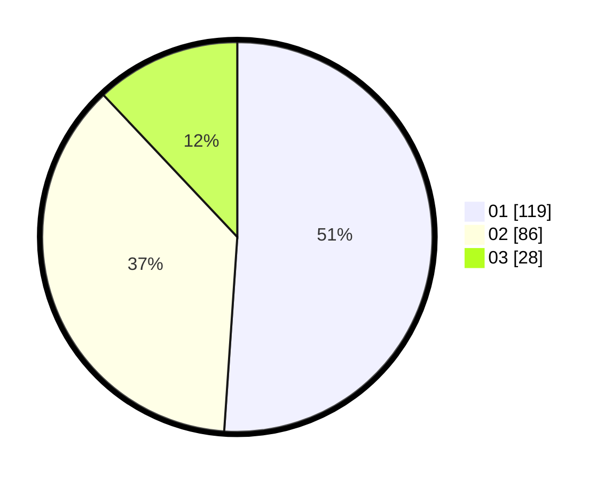

# Hasil

Hasil perolehan suara paslon dapat dilihat pada file paslon-01.txt, paslon-02.txt, dan paslon-03.txt.

Jika tidak ada, artinya data tersebut belum ada pada SIREKAP.

## Perolehan Suara

 * Paslon 01: **119**.
 * Paslon 02: **86**.
 * Paslon 03: **28**.

## Foto C Plano

https://sirekap-obj-formc.kpu.go.id/1096/pemilu/ppwp/31/75/04/10/04/3175041004003-20240214-192356--f25f23db-92bd-45ca-a13c-1dfb14f10646.jpg

https://sirekap-obj-formc.kpu.go.id/1096/pemilu/ppwp/31/75/04/10/04/3175041004003-20240214-192544--b523d6a3-73e6-42f7-8919-299984722094.jpg

https://sirekap-obj-formc.kpu.go.id/1096/pemilu/ppwp/31/75/04/10/04/3175041004003-20240214-192747--9681ea05-01db-43d7-93c2-f25e4c4d4b50.jpg

## DATA PEMILIH TETAP

Jumlah pemilih dalam DPT: **273**.
 * L: **142**.
 * P: **131**.

## DATA PENGGUNA HAK PILIH

Jumlah pengguna hak pilih dalam DPT: **233**.
 * L: **117**.
 * P: **116**.

Jumlah pengguna hak pilih dalam DPTb: **0**.
 * L: **0**.
 * P: **0**.

Jumlah pengguna hak pilih dalam DPK: **4**.
 * L: **2**.
 * P: **2**.

Jumlah pengguna hak pilih: **237**.
 * L: **119**.
 * P: **118**.

## JUMLAH SUARA SAH DAN TIDAK SAH

JUMLAH SELURUH SUARA SAH: **233**.

JUMLAH SUARA TIDAK SAH: **4**.

JUMLAH SELURUH SUARA SAH DAN SUARA TIDAK SAH: **237**.
