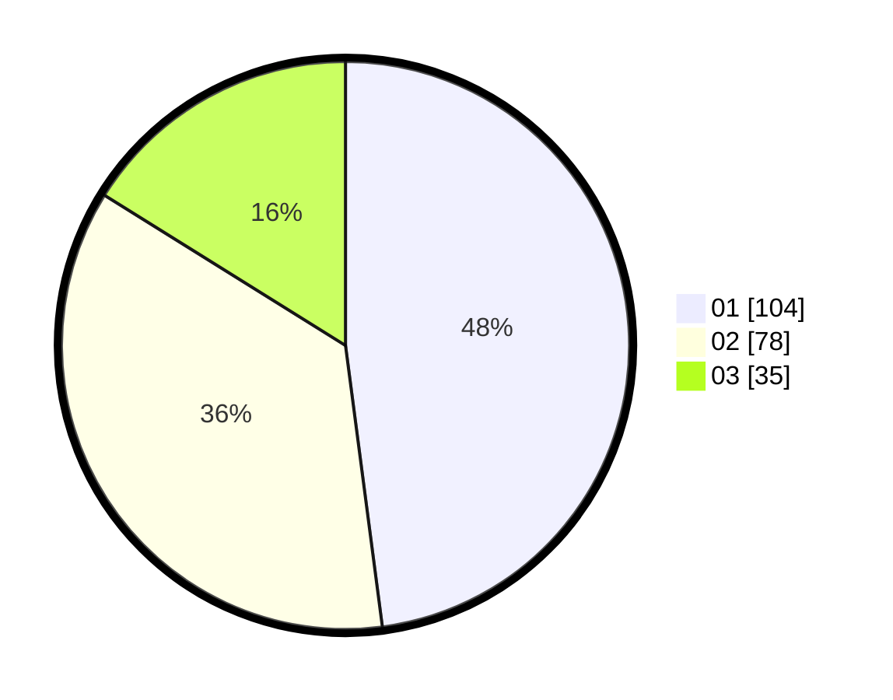

# Hasil

Hasil perolehan suara paslon dapat dilihat pada file paslon-01.txt, paslon-02.txt, dan paslon-03.txt.

Jika tidak ada, artinya data tersebut belum ada pada SIREKAP.

## Perolehan Suara

 * Paslon 01: **104**.
 * Paslon 02: **78**.
 * Paslon 03: **35**.

## Foto C Plano

https://sirekap-obj-formc.kpu.go.id/550c/pemilu/ppwp/31/75/04/10/04/3175041004006-20240215-002144--5d57cfd5-4453-49f4-9a1a-ecea97e2b2f4.jpg

https://sirekap-obj-formc.kpu.go.id/550c/pemilu/ppwp/31/75/04/10/04/3175041004006-20240215-002455--e685d39b-6f1c-4227-b572-cfcc8fa17c9b.jpg

https://sirekap-obj-formc.kpu.go.id/550c/pemilu/ppwp/31/75/04/10/04/3175041004006-20240215-002631--f4e756fe-5781-4840-a0c6-4d0e16ea39be.jpg
