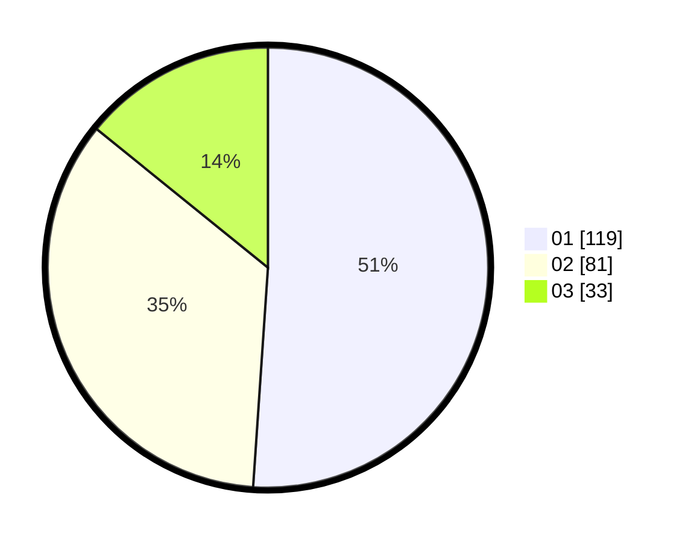

# Hasil

Hasil perolehan suara paslon dapat dilihat pada file paslon-01.txt, paslon-02.txt, dan paslon-03.txt.

Jika tidak ada, artinya data tersebut belum ada pada SIREKAP.

## Perolehan Suara

 * Paslon 01: **119**.
 * Paslon 02: **81**.
 * Paslon 03: **33**.

## Foto C Plano

https://sirekap-obj-formc.kpu.go.id/b663/pemilu/ppwp/31/75/04/10/04/3175041004012-20240215-110511--a4d2bbf6-4619-4546-ac05-ff8f4b84d5c2.jpg

https://sirekap-obj-formc.kpu.go.id/b663/pemilu/ppwp/31/75/04/10/04/3175041004012-20240215-110551--df932799-5adf-44c9-a500-3057ae4c59bc.jpg

https://sirekap-obj-formc.kpu.go.id/b663/pemilu/ppwp/31/75/04/10/04/3175041004012-20240214-215418--3216bf76-2566-4f45-82a8-5526735ad7a1.jpg
