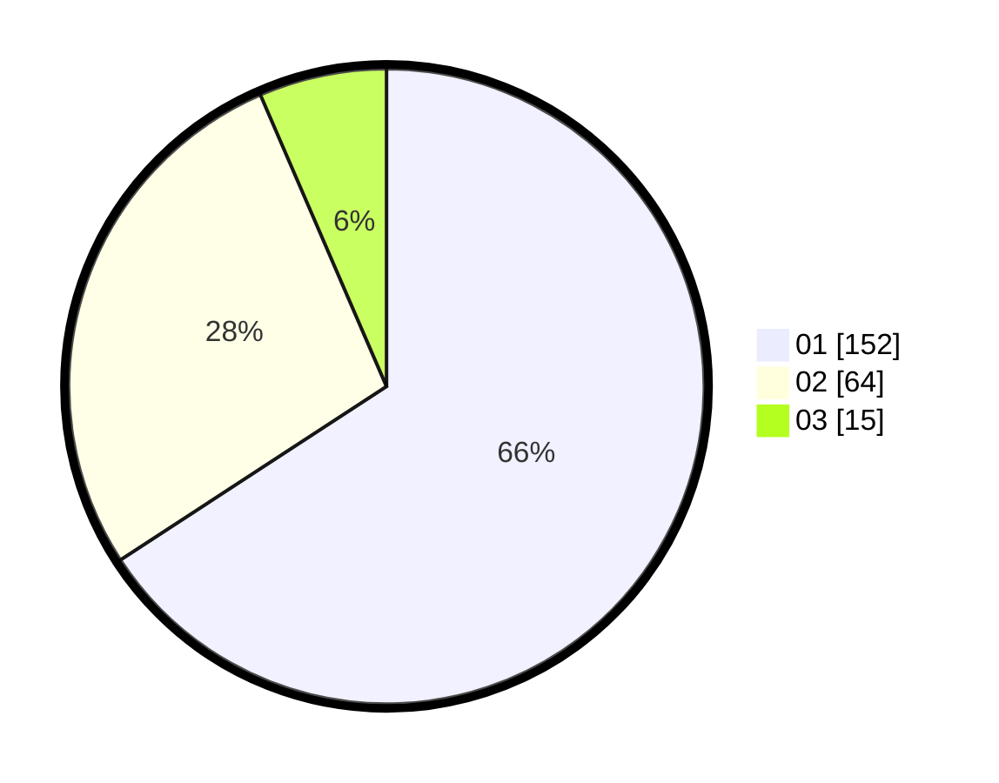

# Hasil

Hasil perolehan suara paslon dapat dilihat pada file paslon-01.txt, paslon-02.txt, dan paslon-03.txt.

Jika tidak ada, artinya data tersebut belum ada pada SIREKAP.

## Perolehan Suara

 * Paslon 01: **152**.
 * Paslon 02: **64**.
 * Paslon 03: **15**.

## Foto C Plano

https://sirekap-obj-formc.kpu.go.id/d252/pemilu/ppwp/31/75/04/10/04/3175041004013-20240214-190155--73e578af-7ae3-4d1b-b022-0a1907623fc2.jpg

https://sirekap-obj-formc.kpu.go.id/d252/pemilu/ppwp/31/75/04/10/04/3175041004013-20240214-190327--147467c8-eb69-49e7-b06b-9f16d513d4d2.jpg

https://sirekap-obj-formc.kpu.go.id/d252/pemilu/ppwp/31/75/04/10/04/3175041004013-20240214-190417--772d4533-f892-40f5-8fdc-365c1a87ce66.jpg

## DATA PEMILIH TETAP

Jumlah pemilih dalam DPT: **280**.
 * L: **147**.
 * P: **133**.

## DATA PENGGUNA HAK PILIH

Jumlah pengguna hak pilih dalam DPT: **231**.
 * L: **120**.
 * P: **111**.

Jumlah pengguna hak pilih dalam DPTb: **1**.
 * L: **0**.
 * P: **1**.

Jumlah pengguna hak pilih dalam DPK: **0**.
 * L: **0**.
 * P: **0**.

Jumlah pengguna hak pilih: **232**.
 * L: **120**.
 * P: **112**.

## JUMLAH SUARA SAH DAN TIDAK SAH

JUMLAH SELURUH SUARA SAH: **231**.

JUMLAH SUARA TIDAK SAH: **1**.

JUMLAH SELURUH SUARA SAH DAN SUARA TIDAK SAH: **232**.
