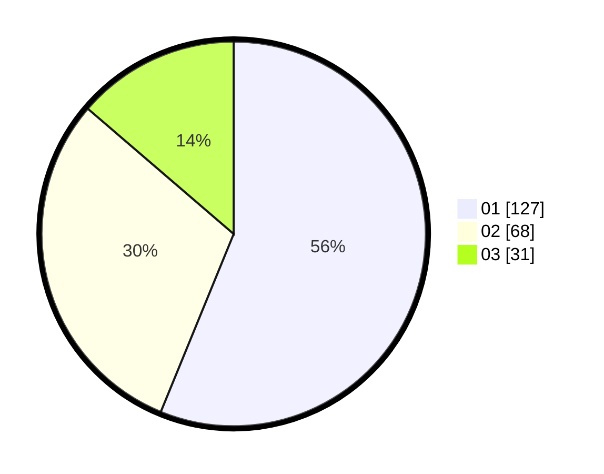

# Hasil

Hasil perolehan suara paslon dapat dilihat pada file paslon-01.txt, paslon-02.txt, dan paslon-03.txt.

Jika tidak ada, artinya data tersebut belum ada pada SIREKAP.

## Perolehan Suara

 * Paslon 01: **127**.
 * Paslon 02: **68**.
 * Paslon 03: **31**.

## Foto C Plano

https://sirekap-obj-formc.kpu.go.id/f972/pemilu/ppwp/31/75/04/10/04/3175041004015-20240217-212235--28566c2d-04c3-4e64-9160-3945d7175762.jpg

https://sirekap-obj-formc.kpu.go.id/f972/pemilu/ppwp/31/75/04/10/04/3175041004015-20240217-212536--abf2637e-3600-46be-a0f6-73e25cfe7ccb.jpg

https://sirekap-obj-formc.kpu.go.id/f972/pemilu/ppwp/31/75/04/10/04/3175041004015-20240217-212724--413cee44-c567-495d-b553-bc6c06ac4203.jpg
