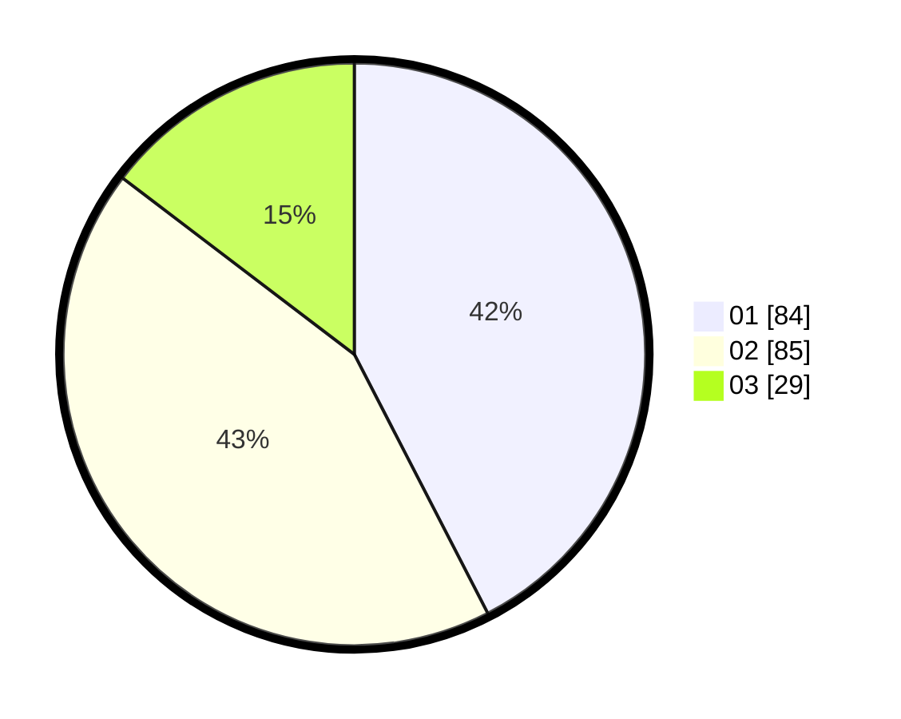

# Hasil

Hasil perolehan suara paslon dapat dilihat pada file paslon-01.txt, paslon-02.txt, dan paslon-03.txt.

Jika tidak ada, artinya data tersebut belum ada pada SIREKAP.

## Perolehan Suara

 * Paslon 01: **84**.
 * Paslon 02: **85**.
 * Paslon 03: **29**.

## Foto C Plano

https://sirekap-obj-formc.kpu.go.id/1c9a/pemilu/ppwp/31/75/04/10/04/3175041004016-20240215-003228--b72f8c51-603f-4796-9b8f-af01fd9bfe2d.jpg

https://sirekap-obj-formc.kpu.go.id/1c9a/pemilu/ppwp/31/75/04/10/04/3175041004016-20240215-003522--bbce8680-1f35-4eef-9536-77e4bcf727be.jpg

https://sirekap-obj-formc.kpu.go.id/1c9a/pemilu/ppwp/31/75/04/10/04/3175041004016-20240215-003544--c4efbd51-3a32-40f2-9710-c7ac553d5b1d.jpg

## DATA PEMILIH TETAP

Jumlah pemilih dalam DPT: **274**.
 * L: **140**.
 * P: **134**.

## DATA PENGGUNA HAK PILIH

Jumlah pengguna hak pilih dalam DPT: **201**.
 * L: **96**.
 * P: **105**.

Jumlah pengguna hak pilih dalam DPTb: **0**.
 * L: **0**.
 * P: **0**.

Jumlah pengguna hak pilih dalam DPK: **0**.
 * L: **0**.
 * P: **0**.

Jumlah pengguna hak pilih: **201**.
 * L: **96**.
 * P: **105**.

## JUMLAH SUARA SAH DAN TIDAK SAH

JUMLAH SELURUH SUARA SAH: **199**.

JUMLAH SUARA TIDAK SAH: **4**.

JUMLAH SELURUH SUARA SAH DAN SUARA TIDAK SAH: **203**.
