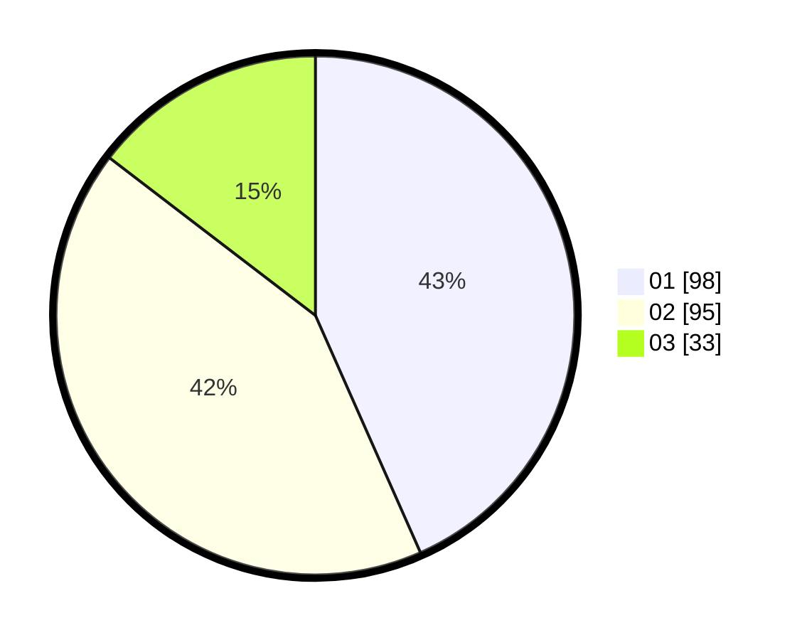

# Hasil

Hasil perolehan suara paslon dapat dilihat pada file paslon-01.txt, paslon-02.txt, dan paslon-03.txt.

Jika tidak ada, artinya data tersebut belum ada pada SIREKAP.

## Perolehan Suara

 * Paslon 01: **98**.
 * Paslon 02: **95**.
 * Paslon 03: **33**.

## Foto C Plano

https://sirekap-obj-formc.kpu.go.id/d081/pemilu/ppwp/31/75/04/10/04/3175041004017-20240215-022029--79ae9fc9-73eb-4b9c-8ba0-2081dad9dc26.jpg

https://sirekap-obj-formc.kpu.go.id/d081/pemilu/ppwp/31/75/04/10/04/3175041004017-20240215-022152--3ec8cbd5-2c8b-4cbf-8165-897cfe7e5b88.jpg

https://sirekap-obj-formc.kpu.go.id/d081/pemilu/ppwp/31/75/04/10/04/3175041004017-20240215-022306--eefd4823-11bb-41e9-b416-c586e52f176b.jpg
