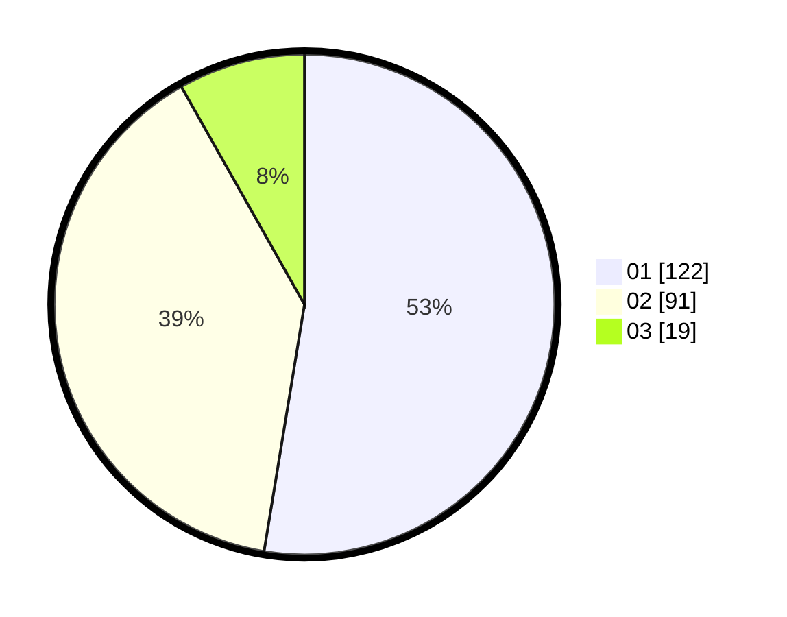

# Hasil

Hasil perolehan suara paslon dapat dilihat pada file paslon-01.txt, paslon-02.txt, dan paslon-03.txt.

Jika tidak ada, artinya data tersebut belum ada pada SIREKAP.

## Perolehan Suara

 * Paslon 01: **122**.
 * Paslon 02: **91**.
 * Paslon 03: **19**.

## Foto C Plano

https://sirekap-obj-formc.kpu.go.id/f581/pemilu/ppwp/31/75/04/10/04/3175041004018-20240214-234122--5c8c1372-233f-4fdb-ac92-e147c099bbe6.jpg

https://sirekap-obj-formc.kpu.go.id/f581/pemilu/ppwp/31/75/04/10/04/3175041004018-20240214-223718--9cfb84ff-33ff-4029-8746-f965ff982909.jpg

https://sirekap-obj-formc.kpu.go.id/f581/pemilu/ppwp/31/75/04/10/04/3175041004018-20240214-223827--d61b64ce-550a-438f-ad94-e93d3f9909af.jpg
