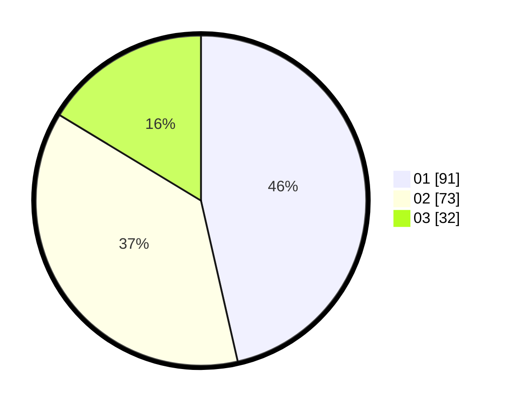

# Hasil

Hasil perolehan suara paslon dapat dilihat pada file paslon-01.txt, paslon-02.txt, dan paslon-03.txt.

Jika tidak ada, artinya data tersebut belum ada pada SIREKAP.

## Perolehan Suara

 * Paslon 01: **91**.
 * Paslon 02: **73**.
 * Paslon 03: **32**.

## Foto C Plano

https://sirekap-obj-formc.kpu.go.id/02a8/pemilu/ppwp/31/75/04/10/04/3175041004029-20240215-015220--f40c5687-a402-42dd-998a-ab0e9711a278.jpg

https://sirekap-obj-formc.kpu.go.id/02a8/pemilu/ppwp/31/75/04/10/04/3175041004029-20240215-020312--5819bc1f-3808-46ba-98ec-05afe61b627e.jpg
