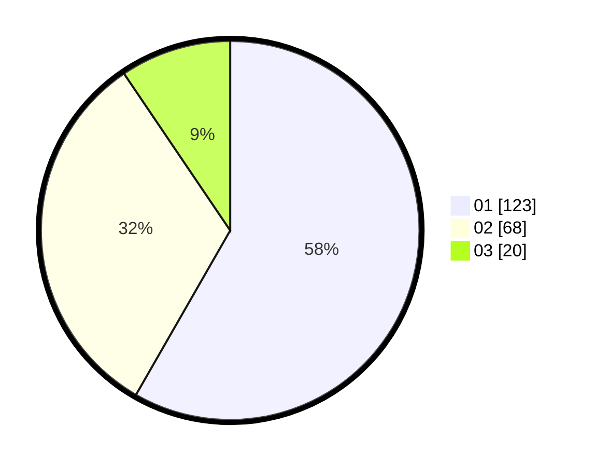

# Hasil

Hasil perolehan suara paslon dapat dilihat pada file paslon-01.txt, paslon-02.txt, dan paslon-03.txt.

Jika tidak ada, artinya data tersebut belum ada pada SIREKAP.

## Perolehan Suara

 * Paslon 01: **123**.
 * Paslon 02: **68**.
 * Paslon 03: **20**.

## Foto C Plano

https://sirekap-obj-formc.kpu.go.id/f0b9/pemilu/ppwp/31/75/04/10/04/3175041004033-20240215-110413--bd2e9875-034a-4fcd-bbe8-bf417bc47bcd.jpg

https://sirekap-obj-formc.kpu.go.id/f0b9/pemilu/ppwp/31/75/04/10/04/3175041004033-20240215-110541--471e5624-975f-4d63-abed-43af0d1a0d8a.jpg
