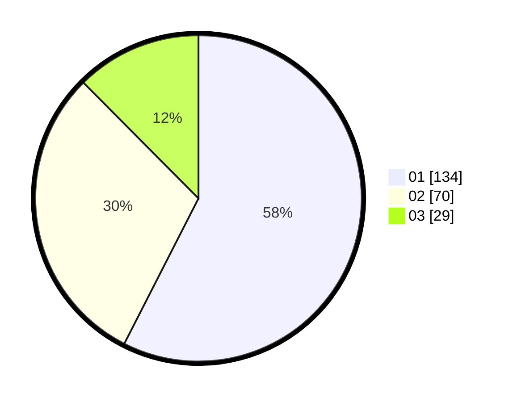

# Hasil

Hasil perolehan suara paslon dapat dilihat pada file paslon-01.txt, paslon-02.txt, dan paslon-03.txt.

Jika tidak ada, artinya data tersebut belum ada pada SIREKAP.

## Perolehan Suara

 * Paslon 01: **134**.
 * Paslon 02: **70**.
 * Paslon 03: **29**.

## Foto C Plano

https://sirekap-obj-formc.kpu.go.id/fa6c/pemilu/ppwp/31/75/04/10/04/3175041004034-20240214-155603--d4ca495c-cbd3-4418-a608-4e6dc9495e95.jpg

https://sirekap-obj-formc.kpu.go.id/fa6c/pemilu/ppwp/31/75/04/10/04/3175041004034-20240214-155747--5b1f4dad-5d8a-453f-a6b7-a0653e7feda4.jpg
