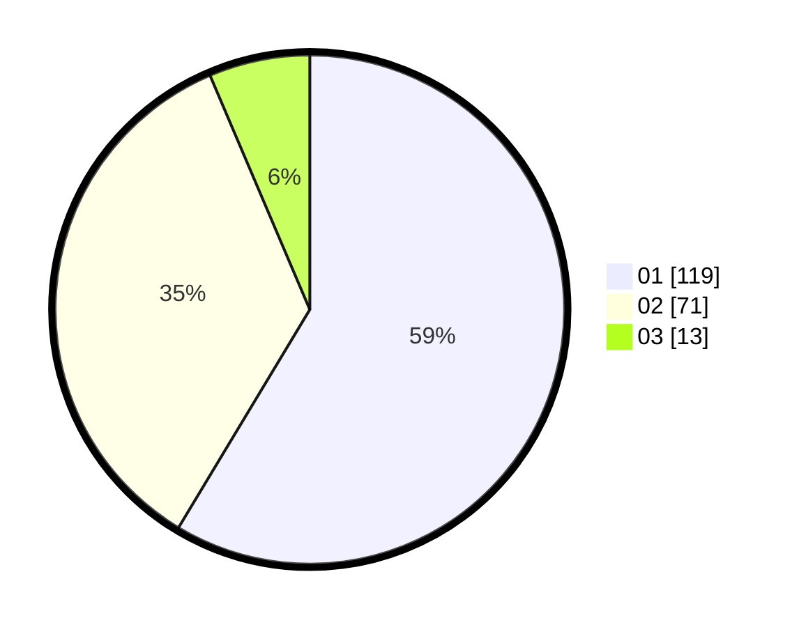

# Hasil

Hasil perolehan suara paslon dapat dilihat pada file paslon-01.txt, paslon-02.txt, dan paslon-03.txt.

Jika tidak ada, artinya data tersebut belum ada pada SIREKAP.

## Perolehan Suara

 * Paslon 01: **119**.
 * Paslon 02: **71**.
 * Paslon 03: **13**.

## Foto C Plano

https://sirekap-obj-formc.kpu.go.id/5851/pemilu/ppwp/31/75/04/10/04/3175041004041-20240214-190050--b157cea5-5eb1-43ff-915b-e88c1769157a.jpg

https://sirekap-obj-formc.kpu.go.id/5851/pemilu/ppwp/31/75/04/10/04/3175041004041-20240214-190137--281032fe-e616-47b2-b427-a02c3c69ed8c.jpg

https://sirekap-obj-formc.kpu.go.id/5851/pemilu/ppwp/31/75/04/10/04/3175041004041-20240214-190141--18cca439-0a64-4ab0-8f9f-c4696475cedb.jpg

## DATA PEMILIH TETAP

Jumlah pemilih dalam DPT: **269**.
 * L: **134**.
 * P: **135**.

## DATA PENGGUNA HAK PILIH

Jumlah pengguna hak pilih dalam DPT: **205**.
 * L: **95**.
 * P: **110**.

Jumlah pengguna hak pilih dalam DPTb: **0**.
 * L: **0**.
 * P: **0**.

Jumlah pengguna hak pilih dalam DPK: **0**.
 * L: **0**.
 * P: **0**.

Jumlah pengguna hak pilih: **205**.
 * L: **95**.
 * P: **110**.

## JUMLAH SUARA SAH DAN TIDAK SAH

JUMLAH SELURUH SUARA SAH: **203**.

JUMLAH SUARA TIDAK SAH: **2**.

JUMLAH SELURUH SUARA SAH DAN SUARA TIDAK SAH: **205**.
